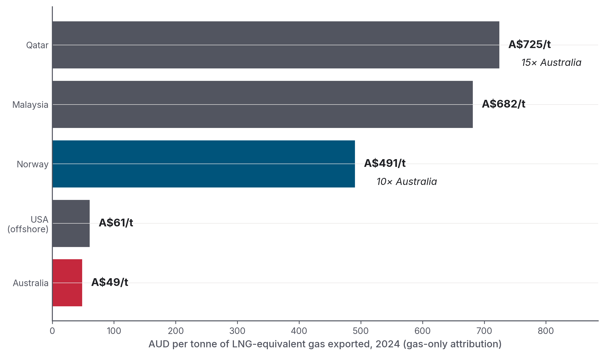
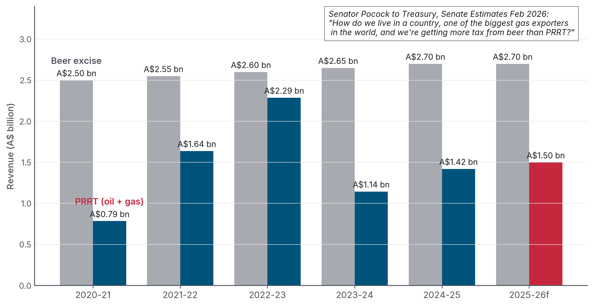
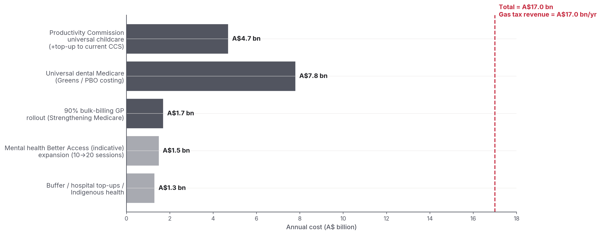
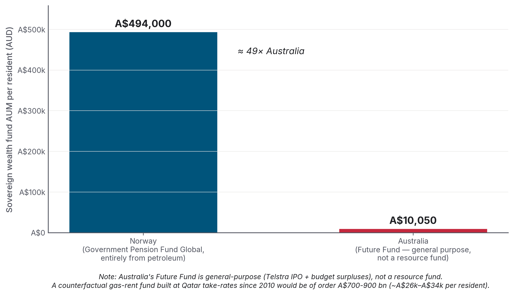
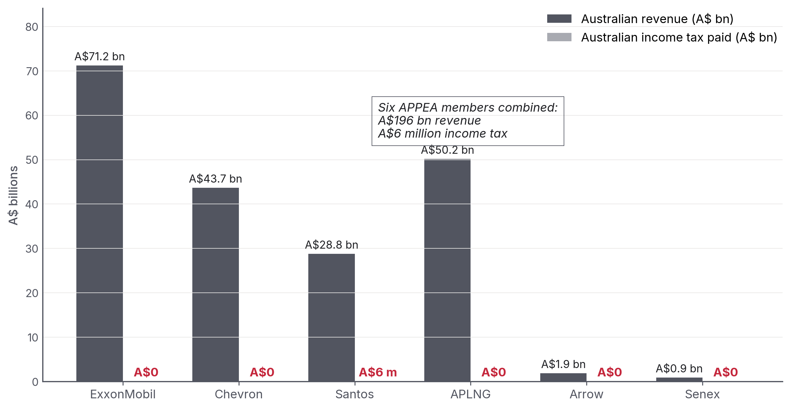
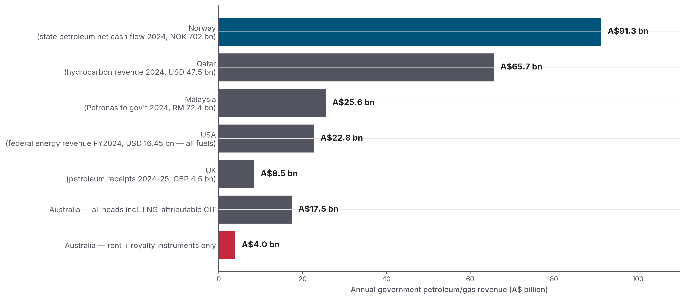

<div align="center">

<a href="https://instats.org">
  
</a>

# Australia's Gas Export Tax Revenue
## *The Definitive Accounting*

**A source-documented policy analysis of how much revenue Australia actually collects from its gas exports, set against beer excise, HECS, the Norwegian Government Pension Fund Global, the Qatar fiscal regime, and Budget 2026-27.**

<p>
  <a href="https://mzyphur.github.io/gas-tax/">
    
  </a>
  <a href="https://github.com/mzyphur/gas-tax/releases/latest">
    
  </a>
</p>

<p>
  
  
  
  
</p>

</div>

---

## What this is

In 2026-27, Australia is expected to collect **A$1.9 billion** from the Petroleum Resource Rent Tax (PRRT). In the same year, Australians are expected to pay **A$2.81 billion in excise on beer**.

This report explains how a country that is the world's second-largest LNG exporter, with current export volumes of roughly 80 million tonnes a year worth ~A$64-92 billion, ends up collecting more tax from beer drinkers than it does in PRRT, the headline federal rent tax on offshore gas exports. It also sets out what a 25% LNG export levy could fund.

## Public audit package

This public repository contains the material needed to inspect the report's factual surface:

- the report source manuscript at [`drafts/report.md`](drafts/report.md);
- the canonical numerical manifest at [`data/values.yml`](data/values.yml);
- chart-generation code and rendered chart assets in [`charts/`](charts/);
- cleaned source dossiers in [`research/`](research/), with primary URLs retained in footnotes;
- the web edition in [`docs/`](docs/) and release artefacts in [`final/`](final/).

Instats publishes the report source, numerical manifest, chart code, rendered charts, source dossiers, and release files needed to inspect the report. Additional working files are retained privately by Instats. The author retains responsibility for every numerical claim, interpretation, and recommendation.

## Read it / cite it

| | |
|---|---|
| **Read online** | **<https://mzyphur.github.io/gas-tax/>** |
| Microsoft Word (.docx) | [Latest release ->](https://github.com/mzyphur/gas-tax/releases/latest) |
| PDF | [Latest release ->](https://github.com/mzyphur/gas-tax/releases/latest) |
| Web edition | [`docs/index.html`](docs/index.html) for Pages; HTML and PDF builds attached to the [latest release](https://github.com/mzyphur/gas-tax/releases/latest) |
| Markdown source | [`drafts/report.md`](drafts/report.md) |

**Citation.** Zyphur, M. J. (2026). *Australia's Gas Export Tax Revenue: The Definitive Accounting.* Instats Policy Series, v3.2.4. <https://github.com/mzyphur/gas-tax>. ORCID: [0000-0003-3237-7892](https://orcid.org/0000-0003-3237-7892). DOI: forthcoming via CrossRef.

BibTeX:

```bibtex
@techreport{zyphur2026gas,
  author      = {Zyphur, Michael J.},
  title       = {Australia's Gas Export Tax Revenue: The Definitive Accounting},
  institution = {Instats},
  type        = {Instats Policy Series},
  number      = {v3.2.4},
  year        = {2026},
  url         = {https://github.com/mzyphur/gas-tax},
  note        = {ORCID: 0000-0003-3237-7892. DOI forthcoming via CrossRef.}
}
```

Machine-readable citation: [`CITATION.cff`](CITATION.cff).

## A few of the charts

<table>
<tr>
<td width="33%"></td>
<td width="33%"></td>
<td width="33%"></td>
</tr>
<tr>
<td width="33%"></td>
<td width="33%"></td>
<td width="33%"></td>
</tr>
</table>

All charts live in [`charts/png/`](charts/png/) and [`charts/svg/`](charts/svg/). The chart scripts in [`charts/`](charts/) read from the same numerical manifest used by the report.

## Repository map

```text
gas-tax/
├── docs/              published GitHub Pages web edition
├── drafts/            markdown source of the report
├── data/              canonical numerical manifest
├── charts/            chart scripts plus rendered PNG/SVG assets
├── research/          cleaned evidence dossiers with source footnotes
├── sources/           source tables used by the public audit package
├── final/             release artefacts
├── assets/            Instats public assets
├── CITATION.cff       machine-readable citation
├── LICENSE            CC BY-NC 4.0
├── VERSION            report version
└── README.md
```

## Author

<table>
<tr>
<td valign="top" width="80">
  
</td>
<td valign="top">

**Michael J. Zyphur, PhD**
Instats &nbsp;|&nbsp; [instats.org](https://instats.org)
[support@instats.org](mailto:support@instats.org)

</td>
</tr>
</table>

### License

**Creative Commons Attribution-NonCommercial 4.0 International (CC BY-NC 4.0)** — see [LICENSE](LICENSE). You may share and adapt the work with attribution. Commercial reuse requires written permission.

---

<div align="center">

<sub>Instats Policy Series · 2026 · Public evidence package for audit and citation.</sub>

</div>
