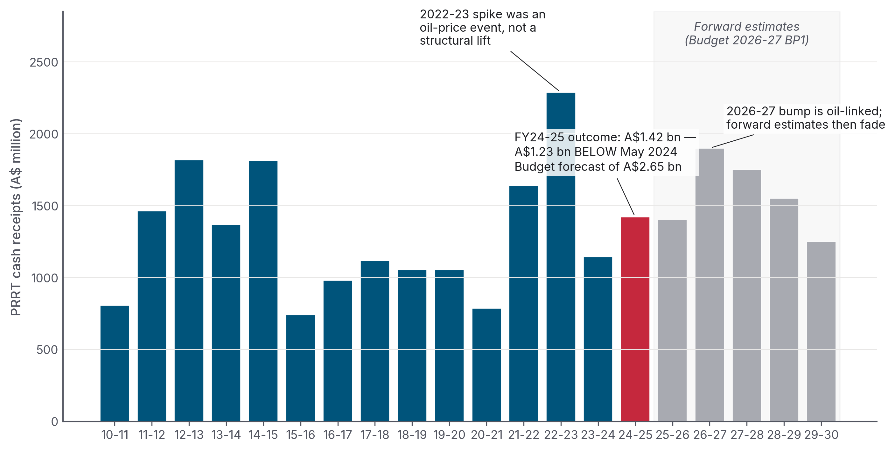
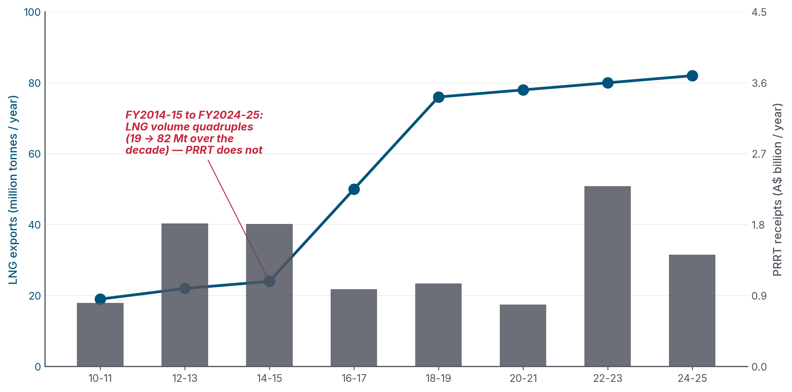
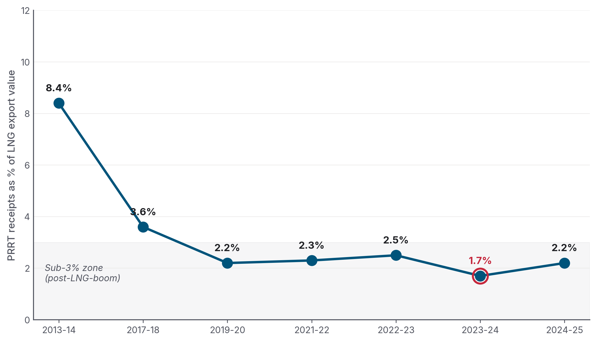
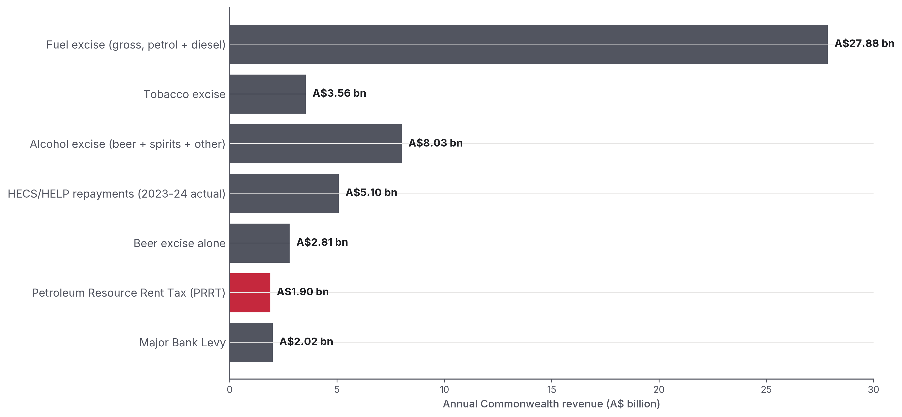
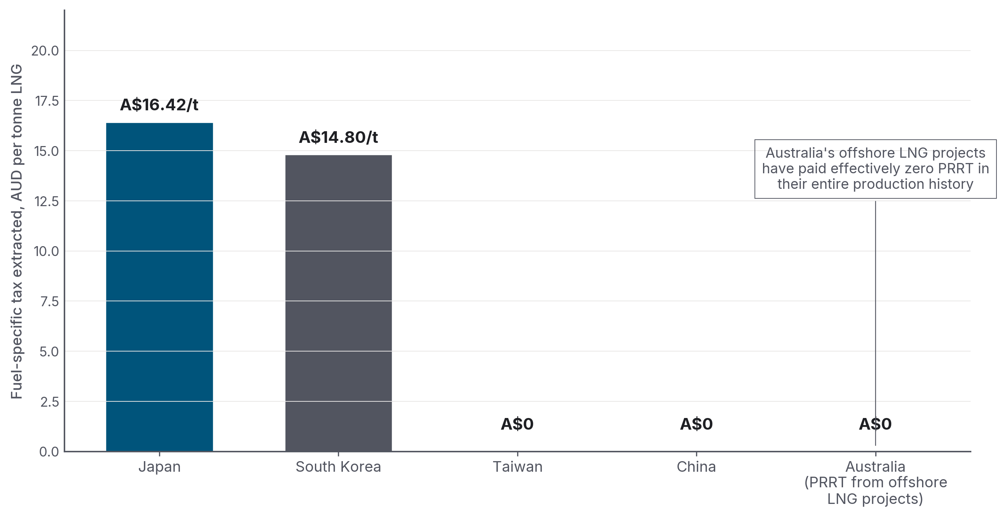
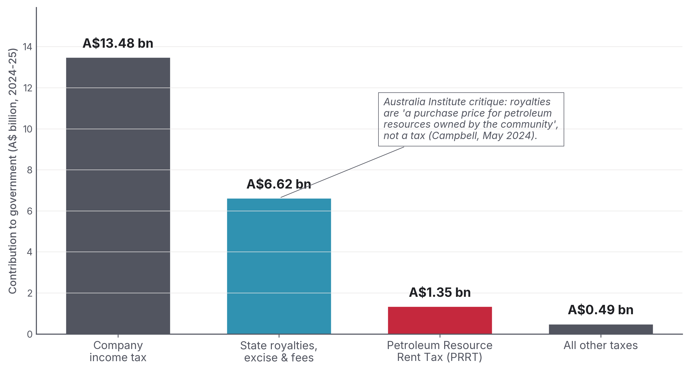

::: cover

{.cover-logo}

::: kicker
INSTATS POLICY SERIES &nbsp;·&nbsp; May 2026
:::

# Australia's Gas Export Tax Revenue
## *The Definitive Accounting*

::: abstract
How much does Australia actually collect from its gas exports? And what does that look like compared with beer excise, HECS debt, a Norwegian sovereign wealth fund, and choices in the current Commonwealth Budget? **The short answer: less than the country collects from beer; about a tenth of what Norway collects per tonne; and roughly A$17 billion a year less than a 25 per cent export tax would raise. That sum is roughly equal to annual Child Care Subsidy spending and more than half the 2026-27 underlying cash deficit.**
:::

::: author
**Michael J. Zyphur, PhD**
Instats &nbsp;·&nbsp; [instats.org](https://instats.org) &nbsp;·&nbsp; [support@instats.org](mailto:support@instats.org)
:::

INSTATS-PS-2026-03

:::

\newpage

::: colophon

**About this report.** *Australia's Gas Export Tax Revenue: The Definitive Accounting* is published by Instats as a public-interest policy document. It draws together the main public source materials on Australia's offshore-gas fiscal regime — Treasury Final Budget Outcomes, ATO Corporate Tax Transparency, DISR Resources and Energy Quarterly, the Callaghan and Henry Reviews, Senate Estimates Hansard, Budget 2026-27, and the equivalent fiscal-architecture documents for Norway, Qatar, the United States, the United Kingdom, Malaysia, Japan and the broader Middle East — and sets the result against the current Commonwealth Budget.

**Read online (one-click web edition).** A live web edition of this report — same content, same charts — is hosted at **<https://mzyphur.github.io/gas-tax/>**. It opens in any browser and can be shared as a link.

**Citation.** Zyphur, M. J. (2026). *Australia's Gas Export Tax Revenue: The Definitive Accounting.* Instats Policy Series, v3.2.3. [github.com/mzyphur/gas-tax](https://github.com/mzyphur/gas-tax). ORCID: [0000-0003-3237-7892](https://orcid.org/0000-0003-3237-7892). DOI: forthcoming via CrossRef (see `CITATION.cff`).

**Public audit package.** The report source, numerical manifest, chart code, rendered charts, cleaned evidence dossiers, and release artefacts are available at **[github.com/mzyphur/gas-tax](https://github.com/mzyphur/gas-tax)**. Additional working files are retained privately by Instats. The [latest GitHub Release](https://github.com/mzyphur/gas-tax/releases/latest) packages the report in Microsoft Word, HTML, and PDF formats.

**License.** Creative Commons Attribution-NonCommercial 4.0 International (CC BY-NC 4.0). You may share and adapt the work with attribution. Commercial reuse requires written permission from the author.

**Currency convention.** All figures in Australian dollars (A$) unless explicitly marked. Foreign-currency primary-source figures are converted at the RBA F11.1 daily fix on 2026-05-11: **1 USD = 1.384 AUD; 1 NOK = 0.130 AUD; 1 GBP = 1.879 AUD; 1 JPY = 0.00883 AUD; 1 KRW = 0.0009365 AUD; 1 RM = 0.353 AUD** (NOK cross-derived via Norges Bank — not in the RBA daily-fix table). Native figures are retained in parentheses where the audit trail benefits. Qualitative findings are robust to ±10 per cent FX variation.

**Methodology summary.** Public audit materials include the source manuscript, numerical manifest, chart scripts, rendered charts, source dossiers, and primary-source footnotes. The author is responsible for every numerical claim, interpretation, and recommendation.

**AI assistance disclosure.** Research review, drafting, code/release checks, and copy-editing used assistance from OpenAI GPT-5.5/Codex, Anthropic Claude Opus 4.7/Claude Code agents, and Google Gemini 3 Flash Preview. The author is responsible for all claims, source interpretation, caveats, calculations, and final wording.

:::

\newpage

::: toc

# Contents

#### [Executive summary](#the-finding)

#### [Part 1 — What Australia actually collects](#part-1-what-australia-actually-collects_1)

- [1.1 &nbsp; The four heads of revenue](#11-the-four-heads-of-revenue)
- [1.2 &nbsp; PRRT in detail — the headline tax that mostly doesn't collect](#12-prrt-in-detail-the-headline-tax-that-mostly-doesnt-collect)
- [1.3 &nbsp; The 2023 deductions cap — a worked example in fiscal under-delivery](#13-the-2023-deductions-cap-a-worked-example-in-fiscal-under-delivery)
- [1.4 &nbsp; Corporate income tax — the ATO's decade of zeros](#14-corporate-income-tax-the-atos-decade-of-zeros)
- [1.5 &nbsp; State royalties and the NWS grandfathered Commonwealth royalty](#15-state-royalties-and-the-nws-grandfathered-commonwealth-royalty)

#### [Part 2 — The Pocock comparisons (and the cleaner ones)](#part-2-the-pocock-comparisons-and-the-cleaner-ones_1)

- [2.1 &nbsp; The beer-versus-PRRT exchange](#21-the-beer-versus-prrt-exchange)
- [2.2 &nbsp; The wider comparator picture](#22-the-wider-comparator-picture)
- [2.3 &nbsp; The Dissenting Report and the HECS / nurses extensions](#23-the-dissenting-report-and-the-hecsnurses-extensions)

#### [Part 3 — How other countries do this](#part-3-how-other-countries-do-this_1)

- [3.1 &nbsp; Norway — the gold standard](#31-norway-the-gold-standard)
- [3.2 &nbsp; Qatar — state ownership replaces tax](#32-qatar-state-ownership-replaces-tax)
- [3.3 &nbsp; United States — federal royalty + state severance + corporate income tax](#33-united-states-federal-royalty-state-severance-standard-corporate-income-tax)
- [3.4 &nbsp; United Kingdom — Ring Fence CT + Energy Profits Levy](#34-united-kingdom-ring-fence-ct-energy-profits-levy)
- [3.5 &nbsp; Malaysia — production-sharing contracts via PETRONAS](#35-malaysia-production-sharing-contracts-via-petronas)
- [3.6 &nbsp; Japan — the destination-market angle](#36-japan-the-destination-market-angle)
- [3.7 &nbsp; The Middle East lesson](#37-the-middle-east-lesson)

#### [Part 4 — The industry's case, in its own words](#part-4-the-industrys-case-in-its-own-words_1)

- [4.1 &nbsp; "We paid for the infrastructure"](#41-we-paid-for-the-infrastructure)
- [4.2 &nbsp; "Long-term contracts mean we don't realise spot prices"](#42-long-term-contracts-mean-we-dont-realise-spot-prices)
- [4.3 &nbsp; "Norway proves a high rate doesn't deter investment — IF the design is cash-flow neutral"](#43-norway-proves-a-high-rate-doesnt-deter-investment-if-the-design-is-cash-flow-neutral)
- [4.4 &nbsp; "The 2023 reforms already happened"](#44-the-2023-reforms-already-happened)
- [4.5 &nbsp; "We do pay — A$21.9 billion in 2024-25"](#45-we-do-pay-a219-billion-in-2024-25)
- [4.6 &nbsp; What survives the critique](#46-what-survives-the-critique)

#### [Part 5 — What A$17 billion a year would buy](#part-5-what-a17-billion-a-year-would-buy_1)

- [5.1 &nbsp; Childcare — universal access](#51-childcare-universal-access)
- [5.2 &nbsp; University, TAFE, and HECS-HELP](#52-university-tafe-and-hecs-help)
- [5.3 &nbsp; Medicare expansion](#53-medicare-expansion)
- [5.4 &nbsp; Housing](#54-housing)
- [5.5 &nbsp; Energy bill relief — the irony](#55-energy-bill-relief-the-irony)
- [5.6 &nbsp; The Norwegian counterfactual — a sovereign wealth fund](#56-the-norwegian-counterfactual-a-sovereign-wealth-fund)
- [5.7 &nbsp; Defence and AUKUS](#57-defence-and-aukus)

#### [Part 6 — Recommendations](#part-6-recommendations_1)

- [6.1 &nbsp; If the goal is rent capture, fix the PRRT design, don't replace it](#61-if-the-goal-is-rent-capture-fix-the-prrt-design-dont-replace-it)
- [6.2 &nbsp; If the goal is gross revenue + simplicity, use a hybrid royalty](#62-if-the-goal-is-gross-revenue-simplicity-use-a-hybrid-royalty)
- [6.3 &nbsp; If the goal is the cleanest political instrument, a 25 per cent export levy](#63-if-the-goal-is-the-cleanest-political-instrument-a-25-per-cent-export-levy)
- [6.4 &nbsp; Whatever else is done, fund a Norway-style sovereign wealth fund](#64-whatever-else-is-done-fund-a-norway-style-sovereign-wealth-fund)
- [6.5 &nbsp; What the political debate keeps getting wrong](#65-what-the-political-debate-keeps-getting-wrong)

#### [Conclusion](#conclusion_1)

#### [Appendix A — Headline data table](#appendix-a-headline-data-table_1)
#### [Appendix B — Public audit notes and version history](#appendix-b-public-audit-notes-and-version-history_1)
#### [Appendix C — Public source package](#appendix-c-public-source-package_1)

#### [Sources and footnotes](#sources-and-footnotes_1)

:::

\newpage

---

::: exec

Executive summary

## The finding

Treasury now estimates that Australia will collect **A$1.4 billion** from the Petroleum Resource Rent Tax (PRRT) in 2025-26 and **A$1.9 billion** in 2026-27, the 2026-27 Budget year in the new papers. In the same two years, Australia is expected to collect **A$2.71 billion** and **A$2.81 billion** in excise on beer.[^pocock_senate][^bp1_table_4_7] The February 2026 Senate Estimates exchange was therefore not overtaken by the new Budget. The 2026-27 papers lift PRRT in the near term, but beer excise still beats PRRT in every forward-estimates year to 2029-30.

Australia is the world's second-largest LNG exporter, shipping roughly 80 million tonnes a year worth A$64–92 billion. Yet it collects more tax from beer drinkers than it does in PRRT — the headline federal rent tax on offshore gas exports. This document explains why. It is a forensic accounting of the four heads of revenue — PRRT, company income tax, state royalties, and the grandfathered North West Shelf royalty. It then compares Australia with Norway, Qatar, the United States, the United Kingdom, Malaysia, Japan as a destination market, and the conventional comparators (beer, fuel, tobacco, HECS) inside Australia's own budget.

It also sets out the strongest version of the industry's defence — back-loading by design, A$300+ billion of capital expenditure (capex), oil-indexed long-term contracts — followed by an honest critique of what stands and what does not. The 2023 PRRT deductions cap, which Treasury forecast would raise A$2.4 billion over the forward estimates, was outweighed by oil-price and FX parameter revisions at MYEFO 2023-24 (PRRT receipts revised down A$0.8 bn for 2023-24 and A$2.4 bn over the four years to 2026-27), with FY2023-24 and FY2024-25 outcomes both A$1.2–1.3 bn below the May 2023 forecast.[^prrt_cap_wipeout] Chevron made its first-ever PRRT payment in August 2025.[^chevron_first_prrt]

A 25 per cent levy on the gross value of LNG exports would raise approximately **A$17 billion per year**.[^ai_25pc] That is the model advanced by the Australia Institute and the Australian Council of Trade Unions, and backed by Senator David Pocock. Set against Budget 2026-27, that is not rounding error. It is **2.13 per cent of total receipts**, **2.04 per cent of total expenses**, **53.9 per cent of the underlying cash deficit**, roughly equal to annual Child Care Subsidy spending, close to the annual JobSeeker income-support line, and almost **nine times** projected PRRT receipts for 2026-27.[^budget_26_27][^bp1_expenses]

The three claims that most often get distorted in this debate, with verdicts:

1. **"Australians pay more tax on beer than companies pay in PRRT."** TRUE This is true every year since 2019-20 on a straight PRRT-vs-beer-excise comparison. It was also confirmed by Treasury officials in Senate Economics Estimates questioning by Senator David Pocock in February 2026, as reported on the Australian Community Media wire and fact-checked TRUE by *The Point*.[^pocock_senate]

2. **"The Japanese government collects more tax on Australian gas than Australia does."** MIXED On the strictest primary-source calculation, Japan's JPY 1,860/tonne Petroleum and Coal Tax applied to 25.1 Mt of 2024 LNG imports from Australia yields approximately **A$412 million a year** in fuel-specific tax at import (`25.1 Mt × 1860 JPY × 0.00883 AUD/JPY`). That is below Australia's A$1.4 billion PRRT total. But the *offshore-LNG share* of Australian PRRT is close to zero. Offshore LNG projects have paid effectively zero PRRT over their lifetimes, with Chevron only entering the PRRT payer pool in August 2025. On a per-tonne LNG basis, Japan's downstream tax of **A$16.42/t** therefore exceeds Australia's upstream rent capture of ~A$0/t from the offshore LNG projects.[^denniss_japan][^japan_dossier]

3. **"The gas industry pays A$21.9 billion a year in 'taxes and royalties'."** DECOMPOSED This is the AEP/industry headline for 2024-25. The breakdown: A$13.5 billion is company income tax, A$6.6 billion is state royalties + excise + fees, only **A$1.35 billion is PRRT**, and the remainder is other industry taxes. Royalties, the Australia Institute notes, are not a tax — they are "a purchase price for petroleum resources owned by the community."[^aep_july2025][^campbell_debunked]

The three points the debate consistently gets wrong:

- **PRRT is not a royalty.** It is a rent tax, designed to apply only after cost recovery + uplift. The two instruments do not substitute, and Australia is unusual in applying one without the other for offshore production.
- **Per-tonne state take, not total revenue, is the like-for-like comparison.** The conservative measure apportions each country's total petroleum revenue by its gas-share of production volume, using RBA-verified 2026-05-11 FX rates of 1 USD = 1.384 AUD and 1 NOK = 0.130 AUD. On that basis, Norway collects roughly **A$491 per tonne of LNG-equivalent gas**, Qatar roughly **A$725**, Malaysia A$682, the United States offshore roughly A$61, and Australia roughly **A$49**. Australia's figure combines PRRT, state royalties and the NWS Commonwealth grant; the offshore-Commonwealth-waters-only figure is closer to A$25–30/t. On total petroleum revenue divided by gas volume only — the *upper-bound* expression — Norway reaches about A$950/t and Qatar about A$1,520/t. The qualitative ordering and the ~10–15× per-tonne ratio against Australia are robust across the methodology choices tested in the dossier.[^international_dossier]
- **"PRRT will eventually deliver" is a defensible claim — but at the price points the Callaghan Review modelled.** The price points required to make the back-loading argument work are higher than the prices Treasury is now forecasting. That is why PRRT receipts have repeatedly missed upside forecasts since 2014-15 — through the LNG-boom build-out and again under the 2023 deductions cap — despite LNG export volumes more than quadrupling over the period.[^prrt_dossier][^callaghan]

The rest of this document walks through the evidence.

:::

---

## Part 1 — What Australia actually collects

### 1.1 The four heads of revenue

Australia's fiscal take from gas exports flows through four separate channels:

- **Petroleum Resource Rent Tax (PRRT).** A 40 per cent federal tax on the economic rents — the "super profits" — of offshore petroleum projects, after cost recovery + uplift. It applies in offshore Commonwealth waters, where royalties generally do not. After 2019, onshore Coal Seam Gas (CSG-LNG) no longer sat inside PRRT. PRRT raised **A$1.42 billion in 2024-25** and is now estimated at A$1.40 billion in 2025-26, A$1.90 billion in 2026-27, and A$1.25 billion by 2029-30.[^bp1_table_4_7]

- **Corporate income tax.** Companies also pay the standard 30 per cent rate on taxable income. For LNG operators in Australia this has been close to zero for many years. The ATO Corporate Tax Transparency Report repeatedly shows major exporters paying zero or near-zero corporate tax against multi-billion-dollar revenues. The industry's own AEP figure for 2024-25 is **A$13.5 billion** — up sharply from the pre-Ukraine baseline of ~A$2.6 billion/year (the trend reflects oil-indexed LNG prices, not structural reform).[^aep_july2025][^campbell_debunked]

- **State royalties.** Queensland levies royalties on CSG-LNG (the Curtis Island plants — APLNG, QCLNG, GLNG); WA levies a state petroleum royalty on the small sliver of WA-water production; the NT levies royalties on Bayu-Undan, Blacktip, and onshore Beetaloo-region production. **Queensland: A$1.71 billion (2023-24)**, expected to decline; **Western Australia state petroleum: A$20–33 million; NT: A$315 million (2024-25).**[^corp_tax_royalties_dossier]

- **The North West Shelf grandfathered Commonwealth royalty.** Australia's oldest offshore LNG project (Woodside-operated, BHP/Shell/Chevron/BP/MIMI partners) was **exempt from PRRT until 2012**, when PRRT was extended to it. The Commonwealth royalty regime continues alongside, with two-thirds of the royalty granted to Western Australia under the Offshore Constitutional Settlement 1979. WA's NWS grant has fallen from **A$1,366 million in 2022-23 to a projected A$224 million by 2027-28** as the field declines.[^corp_tax_royalties_dossier]

A residual "crude oil excise" line applies to legacy Bass Strait oil production, but is no longer a material revenue source.

### 1.2 PRRT in detail — the headline tax that mostly doesn't collect

PRRT was legislated in 1987 to tax economic rent — super profits — from offshore petroleum, but only after a project had recovered its costs and added an uplift. Critically, the original 1987 Act *excluded* both Bass Strait (the largest producing province at the time) and the North West Shelf, as concessions to incumbent industry (Esso/BHP, Woodside JV). **Bass Strait was added to PRRT scope in July 1990, at industry request; the NWS not until July 2012.** That divergence reflects the 1990 Bass Strait inclusion, the post-2010 LNG buildout, and a series of industry-driven concessions: 1991 cross-project deduction transferability, the 2004 Howard government 150 per cent offshore frontier uplift, and the 2005 Gas Transfer Pricing Regulations. Together, those choices produced the back-loading the system displays today.[^callaghan]

<blockquote class="pullquote">
PRRT collections have moved roughly in line with oil production, but have yet to respond to increasing gas production.
<cite>Callaghan Review of the Petroleum Resource Rent Tax (April 2017), p. 39</cite>
</blockquote>

Figure 1 is the chart that captures the central problem.

*Figure 1. PRRT cash receipts did not rise with the LNG boom. The 2022-23 spike was an oil-price spike following Russia's invasion of Ukraine, not structural reform. Budget 2026-27 lifts the 2026-27 estimate to A$1.90 billion on higher oil prices and production volumes, then has receipts fading to A$1.25 billion by 2029-30. Sources: Treasury Final Budget Outcomes FY2010-11 to FY2024-25; Budget Paper 1 2026-27 Statement 5 Table 5.7.*

The annual numbers tell a stark story. PRRT cash receipts averaged **~A$1.1 billion per year through the LNG-boom era** (2014-15 to 2020-21) — *lower* than the early 2010s average of ~A$1.4 billion — despite LNG export volumes more than quadrupling over the same period (Figure 10).[^prrt_dossier]

*Figure 10. Australia's LNG export volume went from about 19 million tonnes a year in 2010-11 to about 82 million tonnes in 2024-25 — a quadrupling. PRRT cash receipts remained broadly flat. Sources: DISR Resources and Energy Quarterly (LNG volume); Treasury Final Budget Outcomes (PRRT cash receipts).*

Why? Three reasons.

**First**, PRRT is back-loaded by design. It taxes economic rent only after a project has recovered its accumulated deductible expenditure. Those deductions also receive an "uplift" — in effect, interest added to the spending: the long-term bond rate plus 5 percentage points for general expenditure, plus 15 percentage points for exploration expenditure. The exploration rate was set in 1988 and never reduced, even after transferability of exploration expenditure between projects was introduced in 1991.[^callaghan_uplift]

**Second**, the deduction stockpile compounded into something the system could not absorb. The Callaghan Review's Figure 2.3 showed the industry-wide stock of carried-forward deductible expenditure climbing from about A$50 billion in 2002 to roughly **A$300 billion by 2015-16**.[^callaghan_deductions] Each year, the unused stock grew with uplift. At LTBR + 15pp for exploration, that stock compounded faster than most reasonable project rates of return. By design, the stockpile was growing faster than the tax system could absorb.

**Third**, the major offshore LNG projects entered production with cost blow-outs that made the deduction shield worse. The cost figures below are industry / trade-press project-cost estimates triangulated from operator project pages, the offshore-energy trade press and standard project-cost trackers; operators do not publish a single audited "final project cost" line in their statutory filings (capex is aggregated into segment-level reporting):

| Project | Operator | FID estimate | Final / current cost |
|---|---:|---:|---:|
| **Gorgon LNG** | Chevron | A$51 bn (US$37 bn, 2009) | **A$75 bn** (US$54 bn)[^gorgon] |
| **Ichthys LNG** | INPEX | A$47 bn (US$34 bn, 2012) | **~A$62 bn** (US$45 bn)[^ichthys] |
| **Wheatstone LNG** | Chevron | A$40 bn (US$29 bn, 2011) | **A$47 bn** (US$34 bn)[^wheatstone] |
| **Pluto Train 2 + Scarborough** | Woodside | A$16.6 bn (US$12 bn, 2021) | A$17.3 bn (US$12.5 bn, ≥86% complete mid-2025)[^scarborough] |

Across 2010–2020, Australia's LNG buildout absorbed roughly **A$300–350 billion of private capital** (industry figure), or about **A$429 billion** (Wood Mackenzie's US$310 billion estimate × 1.384). All of it deductible under PRRT.[^industry_case]

### 1.3 The 2023 deductions cap — a worked example in fiscal under-delivery

In the May 2023 Budget, Treasurer Jim Chalmers announced a 90 per cent cap on PRRT deductions for LNG projects, effective from 1 July 2023, with a 7-year grace period for new projects after first production. The headline revenue estimate at announcement: **+A$2.4 billion over the forward estimates**.[^chalmers_2023]

By MYEFO in December 2023 — seven months after the Budget — Treasury revised PRRT receipts **down by A$0.8 billion in 2023-24 and A$2.4 billion over the four years to 2026-27.** The Australia Institute summarised the result bluntly: "the new regime will collect no new extra revenue." And it was being assessed against *higher* oil-price assumptions than the Budget had used.[^prrt_dossier]

The actual outcome for FY2023-24 was A$1,144 million in PRRT cash receipts — roughly half the original Budget forecast for the year of ~A$2.45 billion.[^prrt_dossier]

The cap *did* do something. Five new entities entered the PRRT payer pool in FY2023-24, including Chevron Australia Holdings, which made its first-ever PRRT payment in August 2025.[^prrt_dossier][^chevron_first_prrt] But the cap limits how much of the deduction stockpile can be used in a year; it does not erase the stockpile. Total cash collected across all 16 entities still came in *lower* than the prior year, because the oil-price tailwind that had inflated 2022-23 receipts was unwinding faster than the cap was adding new payers.

Figure 2 expresses the same problem as a ratio: PRRT receipts as a share of the dollar value of LNG exports.

*Figure 2. In 2013-14, PRRT captured roughly 8 cents of every dollar of LNG exports. By 2023-24, that had fallen below 2 cents. Sources: Treasury Final Budget Outcomes (PRRT cash receipts); DISR Resources and Energy Quarterly (LNG export value).*

The Australia Institute's reframing of the same arithmetic: "$1 of PRRT per $13.60 of petroleum sector exports" in 2022-23, vs $1 per $7.30 in 2016-17, vs $1 per $4 in 2000-01.[^jericho_2024]

<blockquote class="pullquote">
The new regime will collect no new extra revenue.
<cite>The Australia Institute, on the 2023 PRRT deductions cap, after MYEFO 2023-24 revised forward estimates downward by A$2.4 billion seven months after Budget.</cite>
</blockquote>

### 1.4 Corporate income tax: the ATO's decade of zeros

The ATO Corporate Tax Transparency Report has published entity-level total income, taxable income, and tax payable since FY2013-14. The decade-long record for major LNG operators is the single most-quoted dataset in this debate.

| Entity (Australian operations) | Total income, 2013-14 to 2019-20 | Total income tax paid | PRRT |
|---|---:|---:|---:|
| ExxonMobil Australia | **A$71.2 bn** | **A$0** | A$0 (offshore LNG portion) |
| Chevron Australia | **A$43.7 bn** | **A$0** | A$0 (first PRRT payment Aug 2025) |
| Santos | A$28.8 bn | A$6 million | A$0 (onshore CSG-LNG outside PRRT) |
| APLNG (ConocoPhillips/Origin/Sinopec) | ~A$50.2 bn (to 2022-23) | A$0 | n/a (onshore) |
| Arrow Energy (Shell / PetroChina) | A$1.9 bn | A$0 | A$0 |
| Senex | A$0.9 bn | A$0 | A$0 |

*(Source: Australia Institute compilation from ATO Corporate Tax Transparency Reports; cumulative figures verified to dossier 02 in this repository.[^corp_tax_royalties_dossier])*

*Figure 9. Cumulative Australian operating revenue vs cumulative Australian income tax paid, 2014-2020 (Santos extends to 2022-23 to capture later year). Source: Australia Institute, "APPEA members pay no income tax on income of $138 billion," compiled from ATO Corporate Tax Transparency Reports.*

The mechanisms by which multi-tens-of-billions of dollars of revenue become zero taxable income are well-known and lawful. They include project-level ring-fencing, thin capitalisation rules within Australia, large amounts of accelerated depreciation against capex, and aggressive transfer pricing on related-party debt and inter-affiliate gas marketing structures (Chevron Singapore, Shell Swiss/Singapore marketing hubs). Transfer pricing, in plain English, is the setting of internal prices or interest rates between related companies; done aggressively, it can move taxable profit out of Australia. The *Chevron Australia Holdings Pty Ltd v Commissioner of Taxation* [2017] FCAFC 62 appeal is the clean example. The appeal was unanimously dismissed by the Full Federal Court (Allsop CJ, Pagone and Perram JJ) on 21 April 2017. The case concerned **related-party debt** under Division 13 of the ITAA 1936 / Subdivision 815-A of the ITAA 1997 — not transfer pricing on gas sales per se — but its doctrinal significance was the Full Court's rejection of the "orphan theory" of inter-affiliate pricing (i.e. that an Australian subsidiary should be viewed as if it were a stand-alone entity for transfer-pricing purposes). A$340 million in tax was upheld on a US$2.5 billion inter-company loan.[^corp_tax_royalties_dossier][^chevron_fcafc]

The Australia Institute's accumulated framing — five APPEA members with A$138 billion of combined Australian revenue and zero income tax over seven years — is correct and directly verifiable from the ATO data.[^ai_138bn] Post-2022 the headline reversed. 2024 calendar-year contributions to Australian governments — taxes, royalties and levies combined — are now substantial: Chevron A$5 bn, Woodside A$4 bn.[^aep_july2025][^angea_factcheck] But the question is whether that's a structural lift or an oil-price spike — see Part 4.

### 1.5 State royalties and the NWS grandfathered Commonwealth royalty

Most of Australia's offshore LNG is in **Commonwealth waters** where royalties do not apply (PRRT was designed to replace them). The exception is the **North West Shelf** project — Australia's oldest, exempt from PRRT until 2012 and grandfathered into a Commonwealth royalty regime. Two-thirds of the NWS Commonwealth royalty is granted to Western Australia under the Offshore Constitutional Settlement 1979, the Commonwealth-state deal that allocates offshore petroleum revenue. The receipts are falling fast.

The WA Budget Papers show the trajectory clearly:

| Year (FY) | WA NWS grant (A$ million) |
|---|---:|
| 2022-23 | 1,366 |
| 2023-24 | 656 |
| 2024-25 | 591 |
| 2025-26 (est.) | 390 |
| 2026-27 | 283 |
| 2027-28 | 224 |

*Source: Western Australia Budget Paper 3.[^corp_tax_royalties_dossier]*

The decline reflects field depletion: NWS production is past peak and will not be replaced. Meanwhile, **WA's own state petroleum royalty** — applied to the tiny share of WA gas production in state waters, not Commonwealth waters — raised just A$16 million in 2022-23, A$20 million in 2023-24, A$33 million in 2024-25. In fiscal terms, that is very small.

**Queensland** is materially different because of CSG-LNG. Onshore coal seam gas exported through Curtis Island (APLNG, QCLNG, GLNG) generates state royalties — A$1,705 million in 2023-24, projected to decline to A$1,083 million by 2028-29 as global LNG prices normalise.[^corp_tax_royalties_dossier]

**The Northern Territory** raised A$315 million across all royalty categories in 2024-25 (not all from gas).

The structural feature here is simple: **offshore federal-waters LNG — which is the bulk of Australia's LNG export volume — generates negligible royalty revenue.** Royalties were abolished in favour of PRRT. PRRT then collected very little from that base.

---

## Part 2 — The Pocock comparisons (and the cleaner ones)

### 2.1 The beer-versus-PRRT exchange

In February 2026, Senator David Pocock asked Treasury officials, under oath in Senate Economics Estimates:

> *"Would it be accurate to say that the tax on offshore gas exports — PRRT — is still giving us less revenue than the tax on beer?"*

Treasury confirmed:

> *"Taxes on beer were expected to be A$2.7 billion in 2025-26, while taxes from PRRT were expected to be A$1.5 billion."*

Pocock's follow-up — the line that reached a large social-media audience and became a focal point of the public debate:

> *"How do we live in a country, one of the biggest gas exporters in the world, and we're getting more tax from beer than PRRT?"*[^pocock_senate]

The exchange became the basis for the Senate motion of 12 March 2026. That motion carried the satirical short title "Why gas companies pay less for offshore liquefied natural gas than Australians pay in beer excise", but the body actually established was the **Select Committee on the Taxation of Gas Resources** on 30 March 2026. Greens Senator Steph Hodgins-May chaired it; Pocock was a member and active supporter, not the chair. The committee reported on 7 May 2026. Senator Hodgins-May recommended a 25 per cent gas export tax in her additional comments, while Labor and Coalition members dissented, so there was no majority recommendation.[^pocock_select_committee]

<blockquote class="pullquote">
How do we live in a country, one of the biggest gas exporters in the world, and we're getting more tax from beer than PRRT?
<cite>Senator David Pocock, Senate Economics Estimates, February 2026</cite>
</blockquote>

### 2.2 The wider comparator picture

Beer is the cleanest, most rhetorically effective comparator, but it is not the only one. Figure 5 plots PRRT against beer excise across the latest actual and forward-estimates window.

*Figure 5. Beer excise vs PRRT, FY2020-21 to FY2029-30. Beer beats PRRT in every year shown, including narrowly in the Ukraine-spike year of 2022-23 and through the Budget 2026-27 forward estimates. Sources: Treasury Final Budget Outcomes; Budget Paper 1 2026-27 Statement 5 Table 5.7; Senate Estimates February 2026 testimony.*

The wider comparison picture (Figure 6) puts PRRT against the other major Commonwealth revenue lines.

*Figure 6. PRRT (A$1.90 bn in 2026-27) is below fuel excise, below tobacco, below total alcohol excise, below HECS/HELP repayments, below the major bank levy, and below beer excise alone. Source: Budget Paper 1 2026-27 Statement 5 Table 5.7; ATO Taxation Statistics (HECS).*

### 2.3 The Dissenting Report and the HECS/nurses extensions

Pocock himself anchored the original framing in his May 2024 **Dissenting Report to the Senate Economics Legislation Committee on the Treasury Laws Amendment (Tax Accountability and Fairness) Bill 2023**.[^pocock_dissenting] Highlights, verbatim:

> *"In 2022-23, PRRT revenue of $2.4 billion was less than the beer excise ($2.6 billion) and less than half the HELP/SFSS revenue ($4.9 billion)."*

> *"In 2020-21, Australia's nurses paid $5.4 billion, while over the same period, the gas industry paid just $1.8 billion of tax (company income tax plus PRRT). Meaning that nurses paid three times as much tax as the gas industry."*

> *"Four major gas producers… have not paid a single cent in PRRT on combined income of $297 billion."*

> *"In 2021-22 the oil and gas industry paid $926 million PRRT, around 1% of their $89 billion income."*

The Greg Jericho / Jack Thrower analysis (Australia Institute, February 2024) extends the framing:

> *"In the seven years to 2022-23 the government collected a total of $14,962 million more in HECS/HELP than it did from the PRRT — equivalent to 168% more in tax from HECS/HELP than PRRT."*[^jericho_thrower_hecs]

That is: a 2024 analysis found that HECS/HELP — i.e. former students paying back their education debt — had raised, in cumulative terms to 2022-23, **2.68 times what PRRT had raised** over the preceding seven years.

The Senator Matt Canavan rebuttal (Facebook, February 2026) — that adding Woodside's company tax would push gas-industry total tax above beer excise — is correct only for 2022-23 (the Ukraine windfall year). Independent fact-check (*The Point*, 17 Feb 2026) verdict: **TRUE for Pocock's framing on a PRRT-only basis.**[^thepoint_factcheck]

The bottom line for this section: every year for at least the last decade (including the 2021-23 price-spike years on a cash-receipts basis), Australians have paid more excise on their beer than the gas industry has paid in PRRT. In 2026-27, the Budget gap is A$0.91 billion; by 2029-30, Treasury expects beer excise to reach A$3.10 billion while PRRT falls to A$1.25 billion.[^bp1_table_4_7]

---

## Part 3 — How other countries do this

::: callout

### BOX 2 · How the international per-tonne figures are computed

International "state-take per tonne of LNG-equivalent" is computed
on a single, consistent methodology to avoid cherry-picking. For
each comparator country, total petroleum revenue from all four
heads (rent / production / corporate / royalty) is taken from the
country's own annual budget outcome or finance-ministry filing.
That total is divided by total petroleum production volume on a
gas-equivalent basis (oil and condensate converted at standard
energy-content factors). Foreign currencies are converted at the
RBA F11.1 daily fix on 2026-05-11. The full per-country working
is in `research/04_international_comparison.md` in this repo;
qualitative findings are robust to ±10 per cent FX variation.

:::

The sharper comparison, however, is not domestic but international. Per tonne of LNG-equivalent exported, Australia is an order-of-magnitude outlier among the world's major gas exporters.

*Figure 3. Government petroleum revenue per tonne of LNG-equivalent exported, 2024, in AUD. Sources: ATO Corporate Tax Transparency (Australia); Norwegian Petroleum / NPD (Norway); IMF Country Report 25/47, Qatar Ministry of Finance (Qatar); BOEM / DOI (USA); PETRONAS Integrated Report 2024 (Malaysia). FX conversions per `sources/fx_rates.md`.*

*Figure 12. Same picture, expressed as annual government revenue rather than per-tonne. Norway extracts A$91.3 bn/year from petroleum activity (state petroleum net cash flow 2024, NOK 702 bn × 0.130); Qatar A$65.7 bn (hydrocarbon revenue 2024, US$47.5 bn × 1.384); Australia approximately A$4 bn from rent + royalty instruments alone. Including LNG-attributable corporate income tax would put Australia's all-heads figure at approximately A$17.5 bn. Sources as in Figure 3, all converted to AUD at the rates documented in `sources/fx_rates.md`.*

### 3.1 Norway — the gold standard

Norway's regime is the most-cited and the most uncomfortable comparator for Australia. The structure:[^norway_petroleum]

- **22 per cent ordinary corporate income tax.**
- Plus **71.8 per cent special petroleum tax**, a rent tax structured so the corporate tax is creditable against it. The combined marginal rate is **78 per cent** on petroleum profits.
- **State's Direct Financial Interest (SDFI)** — direct state ownership stakes in producing fields. This gives the state cash flow from the fields themselves, rather than waiting for corporate tax.
- **67 per cent state ownership of Equinor** — the Norwegian state directly receives that share of all dividends.
- **Carbon tax on offshore gas** of NOK 2.21 per Sm³ in 2025.

Critically — and this is the design point often missing from Australian comparisons — Norway's system is **cash-flow neutral**. Companies can deduct investments immediately (since the 2022 reform; previously via accelerated depreciation), and losses can be consolidated across the continental shelf rather than ring-fenced at project level. A project that makes financial sense before tax still makes financial sense after tax. The 78 per cent rate is high, but the design does not punish marginal projects.

Norway's state net cash flow from petroleum activities, in AUD (FX = 0.130 AUD/NOK; 2024 actual per *Statsbudsjettet 2026*):[^international_dossier]

| Year | NOK bn | **A$ bn** |
|---|---:|---:|
| 2022 (peak) | 1,457 | **A$189 bn** |
| 2023 | 978 | **A$127 bn** |
| **2024 (actual)** | **702** | **A$91 bn** |
| 2025 (est.) | 656 | **A$85 bn** |
| 2026 (forecast) | 521 | **A$68 bn** |

At the **end of 2025, the Government Pension Fund Global was worth NOK 21,268 billion (A$2.77 trillion)** — the world's largest single sovereign wealth fund.[^npd_2025] Per Norwegian resident (5.63 million at 1 January 2026), that's approximately **A$491,000**.

Australia's Future Fund — a general-purpose fund, not built from petroleum revenue — held A$267.4 billion at 31 December 2025. Per Australian resident (27.72 million at 30 September 2025): **A$9,646**.

<blockquote class="pullquote">
At the end of 2025 the Norwegian Government Pension Fund Global was worth A$2.77 trillion — A$491,000 per Norwegian resident. Australia's Future Fund, not built from any single resource, holds A$9,646 per Australian.
<cite>Norges Bank Investment Management (GPFG) and the Australian Future Fund Management Agency, end-2025 balances</cite>
</blockquote>

*Figure 7. Per-resident sovereign wealth fund AUM, Norway vs Australia, in AUD. Sources: NBIM, GPFG market value at 31 December 2025 (NOK 21,268 bn × 0.130 = A$2.77 trillion); Australian Future Fund Management Agency, end-2025 balance A$267.4 bn. Populations: SSB Q4 2025 / 1 January 2026 (Norway 5,627,400); ABS National, state and territory population, September 2025 release (Australia 27,724,744). The Norwegian fund was built entirely from petroleum revenue; the Australian fund was not built from any specific resource revenue.*

### 3.2 Qatar — state ownership replaces tax

Qatar's gas-revenue capture is structurally different. QatarEnergy (the rebranded Qatar Petroleum) is 100 per cent state-owned. International oil companies — ExxonMobil, Shell, TotalEnergies, ConocoPhillips — hold minority equity in JV vehicles. They also pay corporate tax to the Qatari state at a **statutory minimum 35 per cent rate** on petroleum operations.[^qatar_pwc] On top of that sit royalties (industry-tracker convention puts the gas royalty at **10 per cent of wellhead value**; the precise post-2010 schedule is confidential) and the state's residual equity share of profit.

The verified fiscal picture, in AUD (1 USD = 1.384 AUD, RBA F11.1 fix 2026-05-11 per colophon):[^middle_east_dossier]

- **Qatar 2024 total government revenue: A$81.1 billion (US$58.6 bn)**, of which **A$65.7 billion (US$47.5 bn) — 81 per cent — is hydrocarbons**.
- 2023 hydrocarbon revenue: ~A$79.6 billion (US$57.5 bn).
- Production: ~77 Mt/yr LNG today, expanding to **142 Mt/yr by 2030** with the North Field East/South/West phases.
- **Qatar Investment Authority AUM: ~A$771 billion (US$557 bn, August 2025).**

The Saunders & Campbell paper for the Australia Institute (May 2025) put the comparison in its starkest form: in 2023, Australia and Qatar exported almost the same volume of LNG (81 Mt and 80 Mt respectively, both worth around A$83–86 billion at export value). **Qatar collected A$56 billion in government revenue from that volume. Australia collected A$10.6 billion.** An A$45 billion annual gap.[^qatar_vs_au] If Australia used a Qatar-style regime, it would raise an estimated **A$27 billion a year more.**

Qatar's per-resident hydrocarbon revenue in 2024 was **A$21,070** (US$15,224). Per Qatari citizen (excluding the ~88 per cent non-citizen resident population), the figure is about **A$173,000** per year (US$125,000). Australia's per-capita PRRT take in the same year was approximately **A$50** per person.

### 3.3 United States — federal royalty + state severance + standard corporate income tax

The US has no rent tax — no special tax on super profits — and no state-equity participation. The government does not own shares in the projects. The tax structure is conventional:[^international_dossier]

- **Federal offshore (OCS) royalty: 12.5 per cent on legacy leases, raised to 16.67 per cent statutory minimum (max 18.75 per cent) under the Inflation Reduction Act.**
- **Federal onshore royalty: 12.5 per cent (legacy) / 16.67 per cent (new).**
- **State severance taxes:** 4.6–12.25 per cent depending on state (Texas 7.5 per cent on natural gas market value; Louisiana 12.5 cents/Mcf; etc.).
- **Corporate income tax** at the federal 21 per cent plus state CIT.

The Interior Department reported **A$22.8 billion (US$16.45 bn) of total energy revenue disbursements** for FY2024 (A$8.7 bn to Treasury, A$5.9 bn to states, the balance to the Reclamation Fund, Tribal mineral owners and conservation funds). Of this, **A$9.69 billion (US$7.0 bn) came from the OCS oil and gas program alone**.[^doi_fy2024]

US LNG exports went from 16,253 MMcf in 2014 to 4.37 million MMcf in 2024 — about **88.3 Mt** — making the US the world's largest LNG exporter. The per-tonne gas-only-attributed federal take is approximately **A$61/t** — still **~1.25× Australia's A$49/t** when Australia's PRRT + state royalties + NWS are combined, despite the US having no rent tax and no state-equity participation.

### 3.4 United Kingdom — Ring Fence CT + Energy Profits Levy

UK petroleum activity is taxed via:[^international_dossier]

- **Ring Fence Corporation Tax: 30 per cent**, ring-fenced to UK Continental Shelf activity.
- **Supplementary Charge: 10 per cent** on top.
- **Petroleum Revenue Tax: 0 per cent** since 2016 (rate retained on the books).
- **Energy Profits Levy:** introduced May 2022 at 25 per cent; raised to 35 per cent (1 January 2023) and 38 per cent (1 November 2024). Effective total tax rate now ~78 per cent.

HMRC receipts, in AUD (1 GBP = 1.879 AUD, RBA F11.1 fix 2026-05-11):

| Year | RFCT + SC | PRT | EPL | Total |
|---|---:|---:|---:|---:|
| 2023-24 | A$5.64 bn (£3.0 bn) | −A$0.94 bn (−£0.5 bn) | A$6.76 bn (£3.6 bn) | **A$11.46 bn (£6.1 bn)** |
| 2024-25 | A$3.76 bn (£2.0 bn) | −A$0.75 bn (−£0.4 bn) | A$5.45 bn (£2.9 bn) | **A$8.46 bn (£4.5 bn)** |

EPL receipts fell 20 per cent year on year in 2024-25 due to lower energy prices and reduced production. UK gas is mostly piped to continental Europe; it is not a major LNG exporter. Even so, the Energy Profits Levy (EPL) is the cleanest contemporary international template for a windfall tax and is repeatedly cited by Australian reformers.

The industry often argues that high taxes kill investment, and the UK gives it some evidence. The UK industry says the EPL is killing investment: 4 wells were drilled in 2024, a record low, and Stifel and OBR analysis warned of a £10 bn / A$18.79 bn revenue overestimate to 2030. But Norway's 78 per cent regime coincides with **NOK 275 bn (~A$35.75 bn) of 2025 petroleum sector investment** and Equinor planning 26 wildcat wells in 2026. The difference is design. Norway pairs the 78 per cent rate with immediate cash-flow deductions; the UK EPL was implemented alongside the removal of the 29 per cent investment allowance. Same headline rate, opposite investment trajectories.[^industry_case]

### 3.5 Malaysia — production-sharing contracts via PETRONAS

PETRONAS, Malaysia's state-owned operator, contributes to government revenue through dividends + corporate income tax + petroleum income tax + state hydrocarbon cash payments. The 2024 breakdown, in AUD (1 RM = 0.353 AUD, RBA F11.1 fix 2026-05-11):[^petronas_2024]

| Component | RM bn | **A$ bn** |
|---|---:|---:|
| Dividend to Government of Malaysia | 32.0 | **11.30** |
| Taxes | 26.8 | **9.46** |
| Cash payments for hydrocarbon resources | 13.1 | **4.62** |
| National Trust Fund contribution | 0.5 | **0.18** |
| **Total 2024 government contribution** | **72.4** | **A$25.6 bn** |

PETRONAS Group LNG sales in 2024: 35.7 Mt. Cumulative PETRONAS contribution to the Malaysian government since 1974: RM 1.5 trillion (**A$530 billion**).

### 3.6 Japan — the destination-market angle

The Australia Institute's April 2026 finding that "the Japanese Government collects more tax from Australian gas than the Australian Government" deserves careful handling. The underlying mechanics:[^japan_dossier]

Japan taxes every tonne of LNG it imports. Its **Petroleum and Coal Tax** is **JPY 1,860 per tonne**: a JPY 1,080 base + JPY 780 climate-change surcharge in force since April 2016.[^japan_mof_rates] At 1 JPY = 0.00883 AUD (RBA F11.1 daily fix 2026-05-11), that is **A$16.42 per tonne**. In 2024 Japan imported 25.1 Mt of LNG from Australia (out of 65.9 Mt total).[^meti_yearbook]

Applying the JPY 1,860/tonne rate to 25.1 Mt yields approximately **A$412 million of Japanese tax collected specifically on Australian LNG** at current rates. That figure is verified against the Japan Ministry of Finance's own rate-schedule document. The Australia Institute's own internal figure of A$710 million a year (using a 40 per cent Australian-share assumption on Japan's total LNG-tax base) is somewhat higher; the primary-source-defensible calculation is the lower figure. Either way, the result is well below Australia's PRRT receipts of A$1.4 billion a year.

In other words: **the literal headline "Japan collects more tax from Australian gas than Australia does" does not hold on a straight revenue-vs-revenue basis. Australia's PRRT (A$1.42 bn, FY2024-25 actual) exceeds Japan's tax on Australian LNG (A$412m–A$710m depending on methodology).**

What does hold up — and what the Institute's argument resolves to once unpacked — is the per-tonne LNG-specific comparison:

- **Japan: ~A$16 per tonne** of LNG specifically, collected at import as Petroleum and Coal Tax (JPY 1,860 × 0.00883 AUD/JPY).
- **Australia (PRRT) from offshore LNG projects specifically: ~A$0 per tonne.** (Most LNG projects have paid zero PRRT in their lifetime; the PRRT receipts that do flow are largely from legacy oil-producing assets, not LNG.)

The cleanest defensible statement for a public policy report is: *Japan extracts ~A$16 per tonne of fuel-specific tax on Australian LNG at import; Australia's PRRT on the offshore LNG projects that produced it is effectively zero.* The reason the per-tonne comparison is cleaner than the total-PRRT-vs-total-Japan-tax comparison is that Japan's tax is applied to LNG volume specifically, while Australia's PRRT receipts come overwhelmingly from legacy oil-producing assets rather than from the LNG projects that produced the gas Japan is importing. Volume-weighting at the LNG-specific layer is the like-for-like comparison used here — see Figure 11.

*Figure 11. Per-tonne tax extracted by Australia's major LNG buyer countries (Japan, South Korea, Taiwan, China) at the import end, compared with Australia's per-tonne PRRT from the offshore LNG projects that produced the gas. Sources: Japan MOF Petroleum and Coal Tax (document 333.pdf); South Korea KRW 12/kg individual consumption tax plus KRW 3,800/tonne import surcharge, with Australian-origin customs duty at 0% under KAFTA; China and Taiwan apply no fuel-specific tax. PRRT-on-offshore-LNG figure ~zero per Treasury 2023 statement.*

The broader claim sometimes made — that all of Australia's LNG buyers tax it more heavily than Australia does — is **false**. China, Australia's largest LNG buyer in 2024, levies zero tariff and no fuel-specific tax under the China-Australia Free Trade Agreement (ChAFTA). Taiwan applies no fuel-specific tax. South Korea applies a KRW 12/kg individual consumption tax on power-generation LNG plus a KRW 3,800/tonne import surcharge; Australian-origin LNG enters at 0% customs duty under KAFTA. Together that is **A$14.80/tonne** at the RBA 2026-05-11 KRW fix.[^korea_power_gen_basis] Of Australia's four major LNG markets, Japan and South Korea levy material fuel-specific charges at the import end; China and Taiwan do not.[^japan_dossier]

### 3.7 The Middle East lesson

The Middle East dossier (Section 8 of this repository) catalogues Qatar, UAE, Saudi Arabia, Oman, Algeria, and Iraq. The structural lesson is unambiguous: **every major Middle Eastern gas/oil exporter uses some combination of state ownership + dividends, production-sharing contracts, or high royalties stacked on corporate income tax.**[^middle_east_dossier] Under production-sharing contracts, the state retains 60–85 per cent of production after cost recovery. None uses the Australian PRRT-style rent tax that defers payment until after cost recovery + uplift.

The Saudi Aramco prospectus disclosed a sliding-scale royalty: **15 per cent** on Brent below US$70/bbl (A$97/bbl), **45 per cent** above US$70, **80 per cent** above US$100 (A$138/bbl), on top of a 50 per cent upstream corporate income tax. UAE introduced a 9 per cent federal corporate income tax in June 2023 — modest — but compensates through 100 per cent state ownership of ADNOC. ADNOC Gas alone, the IPO'd subsidiary, paid A$3.4 billion in dividends to the Abu Dhabi government in 2024.[^middle_east_dossier]

The collective UAE sovereign wealth fund AUM (ADIA + Mubadala + ADQ) is now of order **A$2.4–2.5 trillion** (US$1.7–1.8 tn). Per resident: ~**A$242,000** (US$175,000) — comparable to Norway. Per Qatari citizen, the QIA share is ~**A$2.03 million** (US$1.47 m).

---

## Part 4 — The industry's case, in its own words

::: callout

### BOX 1 · How this Part is constructed

This Part sets out the industry's strongest published defence of the current
fiscal arrangements. Every claim restated below is drawn from a
named primary source — Australian Energy Producers media releases
and submissions, Wood Mackenzie / KPMG / Deloitte commissioned
reports, and on-the-record statements from Woodside, Chevron, and
Santos in Senate Estimates Hansard. The strongest available form
of each pillar is presented first, with footnoted citations; the
critique that follows in §4.6 *only* engages with what the
industry has actually argued — not weaker versions of the argument.

:::

Major gas companies and their consultants have made the strongest argument against a windfall tax repeatedly. Australian Energy Producers (AEP, formerly APPEA), Woodside, Chevron, and the Wood Mackenzie / KPMG / Deloitte work commissioned by them all return to five pillars.

### 4.1 "We paid for the infrastructure"

Building Australia's LNG export industry was extremely expensive. Between 2010 and 2020, the buildout absorbed roughly **A$300–350 billion of private capital**, with major project cost blow-outs: Gorgon US$37 → US$54 bn ≈ A$75 bn; Wheatstone US$29 → US$34 bn ≈ A$47 bn; Ichthys US$34 → US$45 bn ≈ A$62 bn. The Callaghan Review (2017) quoted industry: "*Resource projects in Australia are 40 per cent more expensive to deliver than in the United States.*"[^callaghan]

Industry argues: PRRT receipts are low in the 2010s and 2020s **by design** — not by failure. PRRT taxes the rent above cost recovery, and an A$300+ billion capital stack takes years to recover, especially when uplift rates protect the deduction base.

This is internally coherent. And it is the explicit logic the Callaghan Review confirmed:

> *"Under the PRRT arrangements, tax only becomes payable once projects become cash flow positive, meaning all expenditure has been deducted... Given the magnitude of the investment in Australia's petroleum industry over the past decade, it is evident that the PRRT is not discouraging investment in exploration and development of Australia's petroleum resources... The fact that PRRT revenue has been declining and is not rising in line with the increase in LNG production does not of itself indicate that the Australian community is not receiving an equitable return from the development of its resources."*[^callaghan]

Callaghan's own modelling projected **PRRT revenue could total around A$105 billion to 2050 at US$65/bbl; A$170 billion at US$80; A$230 billion at US$100** (page 11).[^callaghan]

### 4.2 "Long-term contracts mean we don't realise spot prices"

About 75 per cent of Australian LNG is sold under long-term, oil-indexed contracts negotiated years before current spot prices. A 25 per cent revenue tax taxes the headline export value, which can be materially above realised prices in a high-spot environment. The 2022 JKM spike (US$30–70/MMBtu) was anomalous; permanent windfall design based on an anomaly is poor policy.

### 4.3 "Norway proves a high rate doesn't deter investment — IF the design is cash-flow neutral"

Norway's 78 per cent regime is paired with immediate cash-flow deductions and continental-shelf-wide loss consolidation. Equinor's organic capex was US$10.2 bn in 2023, US$13.5 bn in 2024, with US$10.6 bn projected for 2025. Norway is drilling 26 wildcat wells in 2026.[^industry_case]

This strengthens the industry's argument against a flat 25 per cent revenue tax: the headline rate is not the whole story. Taxing total sales is materially different from taxing only rent, especially for producers selling under oil-indexed contracts at depressed prices. But it also weakens the industry's *other* argument, that high rates kill investment. Norway falsifies that claim when the design specifics are right.

### 4.4 "The 2023 reforms already happened"

Treasury accepted 8 of the 11 Callaghan recommendations, and the 2023 deductions cap is a substantive (if under-performing) reform. The industry argues the political debate has moved on from "PRRT is broken" to "is PRRT enough?", and that a second round of reform piled on top of the first risks instability for an industry making long-dated FIDs.[^chalmers_2023]

### 4.5 "We do pay — A$21.9 billion in 2024-25"

Industry's headline number. The two industry framings most often quoted, verbatim from primary sources:

<blockquote class="pullquote">
The Australian oil and gas industry is the second-highest corporate taxpayer in Australia, accounting for one in every ten company tax dollars paid.
<cite>Samantha McCulloch, CEO, Australian Energy Producers, July 2025 media release</cite>
</blockquote>

Source note: Australian Energy Producers July 2025 media release.[^industry_case]

Woodside Energy frames it the same way.[^woodside_46pct]

<blockquote class="pullquote">
Our Australian all-in effective tax rate for 2024 was 46 per cent. Put simply, for every A$100 of taxable profit, A$46 of taxes apply.
<cite>Meg O'Neill, CEO, Woodside Energy, 2024 Annual Tax Contribution Report</cite>
</blockquote>

Figure 8 decomposes the A$21.9 billion headline.

*Figure 8. The A$21.9 billion AEP claim for 2024-25, decomposed. A$13.5 bn is company tax, A$6.6 bn is "royalties + excise + fees", A$1.35 bn is PRRT, A$0.5 bn is "all other". Source: Australian Energy Producers media release, 27 July 2025.*

### 4.6 What survives the critique

Three industry claims survive serious examination:

1. **PRRT is back-loaded by design**, not failure. A serious reform debate must engage with the design choice, not pretend it was an accident.
2. **Australian capex was genuinely large.** A$300+ billion of private capital in a decade did build an industry that did not exist before, and the deduction shield is the explicit price the system pays for not deterring that investment.
3. **A flat 25 per cent revenue tax can blur headline export value with realised price.** A producer selling under a US$65/bbl oil-indexed contract receives less than the gross export value would suggest.

And three claims do not:

1. **The "A$21.9 billion" headline is real, but it is not evidence of rent capture.** Company income tax at 30 per cent is what every Australian company pays. The relevant question for the gas-tax debate is rent capture, not company tax — and on that measure (PRRT) the industry pays A$1.35 billion, not A$21.9 billion.
2. **"One in ten company tax dollars" is correct but uninformative.** Same point: company tax is not the rent.
3. **"Investment will flee" is structurally weak.** Norway and the UK both sit at 78 per cent total tax but with opposite investment trajectories. The variable is design, not headline rate. Australia has the option of a Norwegian-style high-rate-cash-flow-neutral design — that's a separate question from whether the rate should rise.

The Australia Institute's three substantive critiques of the AEP framing also stand:[^campbell_debunked]

- **Royalties are not a tax.** They are a purchase price for community-owned petroleum resources. The "builder claiming the cost of bricks as a tax payment" framing is accurate.
- **AEP's number is from a member survey, not ATO data.** Across 2017-18 to 2020-21, the AEP-claimed figure overstates ATO-published tax by an average of 53 per cent.
- **Ukraine windfall masking.** Pre-war, the oil and gas industry paid an average of A$2.6 billion in company tax per year — substantially less than the A$9.5 billion paid annually by Australia's school teachers in personal income tax.

---

## Part 5 — What A$17 billion a year would buy

The Australia Institute / ACTU benchmark estimate is that a 25 per cent levy on the gross value of LNG exports would raise approximately **A$17 billion per year** in additional Commonwealth revenue.[^ai_25pc] This is the headline policy proposal from the Greens, the ACTU, the Australia Institute, IEEFA Australia, and most cross-bench independents (as a 25 per cent flat rate).

Compared with Budget 2026-27, delivered by Treasurer Jim Chalmers on 12 May 2026, A$17 billion is:[^budget_26_27]

- **2.13 per cent of total Commonwealth receipts** (A$798.1 billion).
- **2.04 per cent of total Commonwealth expenses** (A$833.3 billion).
- **53.9 per cent of the 2026-27 underlying cash deficit** (A$31.5 billion).
- **32.7 per cent of total 2026-27 defence spending** (A$52.1 billion); ~1/5 of the AUKUS end-of-decade defence trajectory (~A$80–100 bn/yr by 2034-35).
- **4.8× tobacco excise** (A$3.56 billion).
- **8.9× current PRRT** (A$1.90 billion).
- **Roughly equal to total Commonwealth Child Care Subsidy spending** (A$16.9 billion).
- **Close to annual JobSeeker income support** (A$18.3 billion) and Support for Families (A$18.1 billion).[^bp1_expenses]

<blockquote class="pullquote">
A$17 billion a year is 2.13 per cent of Commonwealth receipts, roughly equal to annual Child Care Subsidy spending, more than half the 2026-27 underlying cash deficit, and almost nine times current PRRT.
<cite>Budget 2026-27, Budget Paper 1; ACTU/Australia Institute 25 per cent LNG export levy estimate</cite>
</blockquote>

The substantive question is what one year's gas tax revenue would *mean* inside the Budget — using current Budget aggregates and primary-source costings of canonical reform proposals. The answer, in one chart:

*Figure 4. A$17 billion per year is not a marginal line item in Budget 2026-27. It is roughly equal to annual Child Care Subsidy spending, close to JobSeeker income support and Support for Families, and more than half the underlying cash deficit. Sources: Budget 2026-27, Budget Paper 1 Statements 5 and 6; ACTU/Australia Institute 25 per cent LNG export levy estimate.*

### 5.1 Childcare — universal access

The **Productivity Commission's *A path to universal early childhood education and care*** (September 2024) costs the universal access reform at +A$4.7 billion per year on top of the existing Child Care Subsidy base.[^pc_childcare] Budget 2026-27 puts Child Care Subsidy program spending at approximately **A$16.9 billion** in 2026-27.[^bp1_expenses] That means one year of the 25 per cent LNG export levy is roughly the size of the entire annual subsidy line, before any dynamic labour-force participation effects. The reform delivers every child aged 0–5 a minimum 30 hours / 3 days a week of high-quality early childhood education and care (ECEC), 48 weeks a year.

The Grattan Institute's *Cheaper Childcare* (2020) costed a 95 per cent targeted subsidy at +A$5 billion/year and a 90 per cent universal subsidy at +A$10 billion/year, with a projected GDP boost of A$24 billion/year from workforce participation effects.[^grattan_childcare]

### 5.2 University, TAFE, and HECS-HELP

Total HECS/HELP debt outstanding in 2023-24 was **A$81.05 billion**.[^hecs_debt] The Albanese government's 2024-25 MYEFO measure cut 20 per cent off all outstanding HELP debt — A$16+ billion erased. The higher-education comparison therefore remains a capital-stock comparison rather than a direct annual Budget line: one A$17 billion year is about one-fifth of the 2023-24 outstanding HELP balance, or roughly the size of the one-off 20 per cent HELP-debt reduction.

The **Universities Accord Final Report (Feb 2024)** identified the funding needed to meet the 80-per-cent-tertiary-qualification target by 2050.[^uni_accord] It called for an A$10 billion Higher Education Future Fund (HEFF; 50/50 Commonwealth/universities) for infrastructure. It also called for a Gonski-style needs-based teaching funding model lifting overall teaching funding by ~11 per cent (~A$1.3 billion/year), plus increased research funding.

**A$17 billion a year is comparable to annual Commonwealth tertiary spending.** It would cover the Accord recommendations + permanent fee-free TAFE + a substantial HECS rate reduction, or wipe out the full HECS/HELP debt balance in roughly five years.

### 5.3 Medicare expansion

Total Commonwealth health spending in 2026-27 is **A$136.9 billion** (Budget Paper 1 Statement 6 Table 6.3). The major medical-services line is **A$37.6 billion** and the Pharmaceutical Benefits program is **A$23.4 billion**. The federal dental-services line remains tiny by comparison, at **A$335 million** in 2026-27.[^bp1_health]

Canonical reform costings:

- **Universal Dental Medicare (Greens / Parliamentary Budget Office costing ECR547, 2022 election):** A$77.6 bn over ten years = **A$7.76 bn/year on average**. The 2025-update version costs ~A$46 bn over four years = **~A$11.5 bn/year** as the program transitions to steady state. The report uses A$8 bn/year as a long-run reference, but a faster rollout (A$11.5 bn/yr) is also plausible.[^greens_dental]
- **90 per cent bulk-billing GP target (the *Strengthening Medicare* package in the 2025-26 Budget):** **A$8.4 bn over five years ≈ A$1.7 bn/year**.[^strengthening_medicare]
- **PBS co-payment reduction from A$31.60 to A$25 (1 January 2026):** A$784.6 million over four years.[^strengthening_medicare]
- **Mental health Better Access expansion (10 → 20 Medicare-rebated sessions per year):** indicative estimate ~A$1.5 bn/year.

**A$17 billion a year covers the long-run-cost version of all four**, but not simultaneously at the faster dental-rollout cost (A$4.7 + A$7.76 + A$1.7 + ~A$1.5 = ~A$15.7 bn, leaving ~A$1.3 bn for hospital top-ups and Indigenous health). Three of those four costings are primary-sourced (PC universal childcare; PBO ECR547 universal dental; BP1 Statement 3 90 per cent bulk-billing). The Better Access expansion is an order-of-magnitude estimate and should be confirmed against a Parliamentary Library / PBO costing before being relied on for a final program design. At the faster dental-rollout cost of ~A$11.5 bn/yr, the combined package would exceed A$17 bn unless another item were deferred or scaled.

### 5.4 Housing

The **Housing Australia Future Fund** is an A$10 billion capital fund delivering 30,000–40,000 social and affordable homes over five years. The National Housing Accord target of 1.2 million new homes over 2024–2029 is well behind trajectory. Building 100,000 social/affordable dwellings at A$500,000–700,000 per dwelling = **A$50–70 billion, or roughly 3–4 years of A$17 bn**.[^budget_dossier]

### 5.5 Energy bill relief — the irony

The 2024-25 Commonwealth Energy Bill Relief Fund cost roughly A$3 billion (rebates to consumers for high energy bills). Australian households received subsidies for the high cost of gas — while gas extracted from Commonwealth waters is exported without a conventional royalty. A 25 per cent export tax would generate roughly 5–6 times the cost of the rebate scheme, every year.

### 5.6 The Norwegian counterfactual — a sovereign wealth fund

If A$17 billion a year were deposited into a sovereign wealth fund earning a **4.5 per cent real return**, the fund would grow quickly. The report uses 4.5 per cent because Norway's GPFG long-run real return is approximately 4.5 per cent over 28 years. That is more conservative than the 6 per cent often quoted in IMF baselines.

| After... | Fund value (A$, real, 4.5% return) |
|---|---:|
| 10 years | **A$209 billion** |
| 20 years | **A$533 billion** |
| 30 years | **A$1.04 trillion** |

(At Norway's higher post-2009 realised return of ~6 per cent, the 30-year figure would be approximately A$1.34 trillion; both are illustrative.)

For comparison, the Norway GPFG took 30 years (1996–2025) to reach NOK 21,268 billion (~A$2.77 trillion). That is a scale benchmark, not a claim that Australia had the same production mix, prices, tax base, or investment-return path.[^norway_gpfg]

### 5.7 Defence and AUKUS

The 2026-27 Defence function is A$52.1 billion. AUKUS Pillar 1 — the Virginia-class and SSN-AUKUS submarine program — is a 30-year commitment, peaking at roughly A$15 billion/year by the mid-2030s. **One A$17 billion year of gas tax revenue is 32.7 per cent of the annual Defence function and covers roughly 14 months of AUKUS Pillar 1 at the mid-2030s annual run-rate.** Framed differently, the full 30-year AUKUS commitment can be funded from roughly 22 years of A$17 billion/year.[^budget_dossier]

This is not an argument for or against AUKUS. It is an argument that the revenue Australia is currently *not* collecting from offshore gas is a major part of the country's fiscal capacity.

---

## Part 6 — Recommendations

There is no single "right" way to fix the gas tax. Australia's peers point to three clear paths: a surgical fix to the PRRT, a standard royalty, and a clean-break export levy. Each faces different legal, political, and industry hurdles. The most stable landing zone is a hybrid: fix PRRT for new projects, apply a royalty to current offshore LNG that pays neither PRRT nor state royalty today, and save part of the proceeds in a Norway-style Future Generations Fund.

### 6.1 If the goal is rent capture, fix the PRRT design, don't replace it

The Henry Review (2010) recommended a 40 per cent uniform Resource Rent Tax — the same rate as the existing PRRT. The Callaghan Review (2017) found PRRT "remains the preferred way to achieve a fair return to the community for the extraction of petroleum resources without discouraging investment, [but] changes should be made to PRRT arrangements." The 2023 deductions cap was a partial implementation of Callaghan. It has under-performed.

The natural next steps are well-mapped:

- **Lower the deductions cap to 80 per cent** (Greens / Senator Pocock proposal in his 2024 Dissenting Report) or 70 per cent (Jericho's preferred Australia Institute scenario). Jericho's modelling shows that a 60 per cent cap would have raised A$10.8 billion more than the actual PRRT take since 2016-17.[^jericho_2024]
- **Reduce the exploration uplift rate** from LTBR + 15 percentage points to something defensible. This rate was set in 1988, before transferability between projects existed. The rationale has not survived the 1990 reform that introduced transferability.
- **Reform the LNG transfer-pricing methodology.** In plain terms, change how the government calculates the "price" of gas for PRRT purposes. The PRRT *Pricing Methodology Regulations 2005* currently mandate the Residual Pricing Method. Norway's *Petroleumsprisrådet* (Petroleum Price Board) is sometimes cited as the model, but Norway's board sets norm prices only for crude oil and NGLs, *not* for natural gas or LNG. For gas, Norway uses actual transaction prices with transfer-pricing principles. The defensible Australian reform is not a literal "norm-price council for LNG". It is a benchmark-anchored gas-transfer-pricing rule (JKM netback or CUP-on-FOB), administered by an institution architecturally modelled on the Norwegian PPB but applied to LNG, with explicit acknowledgement of *Brandy v HREOC* Chapter III constitutional limits on administrative price-setting.
- **Apply the design to NEW projects** to honour the Callaghan principle that "any major change to the design of the PRRT should only apply to new projects." (This is the political compromise that makes reform legally and politically tractable.)

### 6.2 If the goal is gross revenue + simplicity, use a hybrid royalty

The simplest fix is the one many rent-design economists dislike but which produces revenue immediately: **apply a Commonwealth royalty on offshore LNG production**, sized to capture the gas that pays neither PRRT nor state royalty today. The Greens' Robin Hood plan proposes a 10 per cent offshore royalty layered on top of PRRT.[^bandt_robinhood] A simpler 12.5 per cent royalty, matching the US OCS legacy rate, applied to the 2023-24 A$68.59 bn LNG export value, would raise approximately A$8.6 billion a year before PRRT/CIT credits; lower estimates around A$6 billion appear in some advocacy material but require a narrower offshore-only / royalty-free / wellhead-net-of-credits denominator that should be stated explicitly when cited.

Australia's gas resources are owned by the Australian community by constitutional convention. Royalty is the standard mechanism by which resource-owning sovereigns capture rent on extraction. The argument that royalties "discourage investment" is the textbook resource-rent objection. But resources have been extracted under royalty regimes in every major jurisdiction on Earth, including Norway (where the SDFI is, in fiscal effect, a deep royalty), for fifty years.

### 6.3 If the goal is the cleanest political instrument, a 25 per cent export levy

This is the Australia Institute / ACTU / Greens position. **Revenue: ~A$17 billion/year.** The industry counter-arguments are credible: oil-indexed contracts and back-loaded capex matter. But they admit of design fixes. One example is a deduction for documented contract-price-vs-spot-price gaps, with the deduction subject to ATO audit.

### 6.4 Whatever else is done, fund a Norway-style sovereign wealth fund

The gap between Norway's GPFG (**A$2.77 trillion; A$491,000 per Norwegian resident**) and Australia's Future Fund (**A$267.4 billion; A$9,646 per Australian resident**) is **not** primarily explained by Norway being lucky with oil. Norway is unusual in two ways: it ring-fences resource revenue from current spending, and it has done so consistently for 30 years.

Australia's Future Fund was established in 2006 and has done well — but it is general-purpose, not a resource fund. A separate Future Generations Fund — fed by gas tax receipts and walled off from current spending — would do for Australia's mineral generation what the GPFG has done for Norway's: convert depletable resource rent into permanent intergenerational wealth.

### 6.5 What the political debate keeps getting wrong

- **Royalties are not taxes.** They are payment for community-owned resources extracted. Bundling them into "industry contribution" figures inflates the headline.
- **Per-tonne state take, not total revenue, is the like-for-like comparison.** Australia is an **A$49/tonne** outlier in a world where the cheapest credible peer (the United States offshore) collects **A$61/tonne** and the closest analogue (Norway) collects **A$491/tonne** — see Figure 3 for the full gas-only-attribution methodology. Norway's per-tonne take is roughly 10× Australia's; Qatar's roughly 15×.
- **"PRRT works as designed" and "PRRT under-collects" can both be true.** PRRT was designed to back-load: companies pay later, after cost recovery and uplift. The design choice has been validated by the Callaghan Review at the price levels modelled. Whether those price levels are the right ones to bet Australian fiscal capacity on is a separate, legitimate, political question.
- **The "Japanese government collects more tax on our gas than we do" line is a useful slogan but the literal claim does not survive verification.** The accurate replacement is narrower: *per tonne of Australian LNG, Japan extracts ~A$16 of fuel-specific tax at import; Australia extracts ~A$0 of PRRT at extraction. China and Taiwan extract essentially nothing. The total tax design is the problem; the buyer-country line is a symptom.*

---

## Conclusion

Australia is the world's second-largest LNG exporter. It collects more revenue from its citizens' beer than it does from offshore gas. It collects less per tonne of LNG than the United States, less than Malaysia, roughly 15 times less than Qatar, and roughly 10 times less than Norway under the gas-only attribution that Part 3 lays out. Its sovereign wealth fund balance per citizen is roughly fifty-one times less than Norway's.

The political debate is now about three options: a deepened PRRT (a Norwegian-style cash-flow-neutral, high-rate rent tax), a royalty (the US/Qatar model), or a flat 25 per cent export levy (the ACTU / Australia Institute model). Each has trade-offs, but the answer cannot be "do nothing". Budget 2026-27 now estimates PRRT at A$1.40 billion in 2025-26, A$1.90 billion in 2026-27, then A$1.75 billion, A$1.55 billion and A$1.25 billion over the remaining forward-estimates years.[^bp1_table_4_7] Treasury says the near-term upgrade is driven by higher oil prices and production volumes, but the forward path still fades. The 2023 PRRT deductions cap was outweighed by oil-price and FX parameter revisions at MYEFO 2023-24, so the cap did not deliver net new revenue against forward estimates — though Treasury's original A$2.4 bn forecast may still be realised against an unrevised baseline. The Callaghan Review's "PRRT will deliver A$105–230 billion to 2050" projection has not, after eight years, begun to materialise except via the Ukraine oil-price spike.

The case for reform is stark: **as an illustrative arithmetic counterfactual, not a retroactive policy proposal, a Norwegian government take per tonne of Australian LNG applied to the past five years would have funded universal childcare, universal dental, a doubled mental health Better Access expansion (indicative, and not a final program costing), and full HECS-debt elimination. It would also have left A$50 billion in a future generations fund.**

The case against immediate reform is also real: **the existing system was designed to be back-loaded, and the projects it taxes are halfway through a 30-year capital recovery cycle. They have already absorbed two rounds of reform.**

Both sentences are true. The political question is which one matters more in the next federal election cycle.

---

## Appendix A — Headline data table

| Metric | Value | Source |
|---|---:|---|
| PRRT receipts 2026-27 (estimate) | A$1.90 bn | BP1 2026-27 Statement 5 Table 5.7[^bp1_table_4_7] |
| PRRT receipts 2025-26 (estimate) | A$1.40 bn | BP1 2026-27 Statement 5 Table 5.7[^bp1_table_4_7] |
| PRRT receipts 2024-25 (actual) | A$1.42 bn | FBO 2024-25[^prrt_dossier] |
| Beer excise 2026-27 (estimate) | A$2.81 bn | BP1 2026-27 Statement 5 Table 5.7[^bp1_table_4_7] |
| Beer excise 2029-30 (estimate) | A$3.10 bn | BP1 2026-27 Statement 5 Table 5.7[^bp1_table_4_7] |
| HECS/HELP repayments 2023-24 | A$5.10 bn | ATO Taxation Statistics[^international_dossier] |
| Tobacco excise 2026-27 | A$3.56 bn | BP1 2026-27 Statement 5 Table 5.7[^bp1_table_4_7] |
| Fuel excise 2026-27 (gross) | A$27.88 bn | BP1 2026-27 Statement 5 Table 5.7[^bp1_table_4_7] |
| Total Commonwealth receipts 2026-27 | A$798.1 bn | BP1 2026-27 Statement 5 Table 5.1[^budget_26_27] |
| Total Commonwealth expenses 2026-27 | A$833.3 bn | BP1 2026-27 Statement 6 Table 6.1[^bp1_expenses] |
| Underlying cash deficit 2026-27 | A$31.5 bn | BP1 2026-27 Statement 3 / Budget aggregates[^budget_26_27] |
| LNG export value 2022-23 | A$92.24 bn | DISR REQ Dec 2024[^prrt_dossier] |
| LNG export value 2023-24 | A$68.59 bn | DISR REQ Dec 2024[^prrt_dossier] |
| Australian LNG export volume 2024 | ~82 Mt | DISR; international dossier 04 |
| AEP industry "tax & royalties" 2024-25 | A$21.94 bn | AEP media release 27 July 2025[^aep_july2025] |
| Of which: company tax | A$13.48 bn | same |
| Of which: state royalties + excise + fees | A$6.62 bn | same |
| Of which: PRRT | A$1.35 bn | same |
| Of which: "all other taxes" | A$0.49 bn | same |
| Norway 2024 state petroleum net cash flow | **A$91 bn** (NOK 702 bn × 0.130; *Statsbudsjettet 2026* actual) | NPD 2024[^international_dossier] |
| Norway GPFG, end-2025 | **A$2.77 trillion** (NOK 21,268 bn × 0.130) | NBIM[^npd_2025] |
| Qatar 2024 hydrocarbon revenue | **A$65.7 bn** (US$47.5 bn × 1.384), 81% of all govt revenue | Qatar MoF / MEES[^middle_east_dossier] |
| Qatar Investment Authority, Aug 2025 | **A$771 bn** (US$557 bn × 1.384) | swfinstitute.org[^middle_east_dossier] |
| Australia Future Fund, end-2025 | A$267.4 bn (native) | Future Fund Management Agency |
| Per-tonne gas-only state take, Norway | **A$491/t** (gas-only attribution; see Figure 3) | dossier 04 |
| Per-tonne gas-only state take, Qatar | **A$725/t** (gas-only attribution; see Figure 3) | dossier 04 |
| Per-tonne gas-only state take, Malaysia | **A$682/t** (gas-only attribution; see Figure 3) | dossier 04 |
| Per-tonne gas-only state take, USA (offshore) | **A$61/t** (gas-only attribution; see Figure 3) | dossier 04 |
| Per-tonne gas-only state take, Australia (PRRT + state royalties + NWS grants only; excludes LNG-attributable company tax) | **A$49/t** | dossier 04 |
| Japan PCT rate on LNG | JPY 1,860/tonne = **A$16.42/tonne** (× 0.00883 AUD/JPY) | MOF document 333.pdf[^japan_mof_rates] |
| Japan LNG imports from Australia (2024) | 25.1 Mt | METI Yearbook[^meti_yearbook] |
| Japan tax on Australian LNG | **A$412 m/yr** (primary-source, 25.1 Mt × A$16.42/t) | TAI April 2026 + Japan dossier[^denniss_japan] |
| 25% LNG export tax revenue (AI / ACTU estimate) | ~**A$17 bn/yr** | AI live tracker[^ai_25pc] |
| Cumulative foregone since 1 July 2022 (AI live tracker) | A$63.8 bn | TAI live tracker[^ai_25pc] |

---

## Appendix B — Public audit notes and version history

This appendix records public-facing changes to the report and the audit package. The public package is limited to the material needed to inspect the report's factual claims and rendered outputs.

**v3.2.3 (this version)** consolidates three post-Budget-2026-27 patch rounds atop v3.2.0. v3.2.1 was a doc/script-polish round (`sources/fx_rates.md` version-header sweep, `CITATION.cff` date update, chart-script `mkdir` PNG-output-dir asymmetry fix via `style._ensure_output_dirs()`, README final-report.html link cleanup, `docs/index.instats.manifest.txt` logo dedupe, Chart 09 docstring scope-distinguishing wording fix). v3.2.2 closed two findings surfaced by the verify-publication harness: Chart 11 line 52 FX-scanner false-positive marked `# not-fx`; an orphaned `[^budget_25_26]` footnote definition with zero inline references removed (the Budget 2025-26 content was already cited via `[^strengthening_medicare]`, same primary source, no information loss). v3.2.3 closes the 8-reviewer final pre-publication audit findings: this Appendix B narrative bumped; `charts/04_what_17b_buys.py` `# red-clusters: 2` rationale corrected (the second red cluster is the dashed `axvline` reference line plus its red label, not a four-program total band); `[^angea_factcheck]` body text aligned to the ANGEA primary source's own framing ("taxes, royalties and levies combined", not corporate income tax alone); `[^npd_2025]` URL swapped from a 404'd path (`nbim.no/en/the-fund/key-figures/`) to the canonical `nbim.no/en/`; the body's SWF gap re-stated from "one-fortieth" to "roughly fifty-one times less than Norway's" with recomputed per-resident figures; Australia's population denominator updated to the ABS National, state and territory population September 2025 release (27,724,744 residents at 30 September 2025; released 19 March 2026) — the Future Fund per-resident figure recomputed at **A$9,646** (previously A$10,050 against a rounded 26.6 m base); Norway's population denominator updated to SSB Q4 2025 / 1 January 2026 (5,627,400) — GPFG per-resident recomputed at **A$491,000** (previously A$494,000); Norway's 2024 petroleum net cash flow figure in the international comparison dossier updated from the older NOK 680 bn estimate to the verified actual **NOK 702.2 bn**, citing *Statsbudsjettet 2026* Meld. St. 1 (2025-2026) Table 3.5 page 28 (the body text already carried 702 from v3.2.0; only the dossier needed alignment); Figure 7 (the per-resident SWF chart) regenerated against the new populations and ratio (~51×); the AEP "all other" figure (A$0.5 bn rounded in Figure 8, A$0.49 bn precise in Appendix A) confirmed internally consistent; `sources/fx_rates.md` header version-string sweep extended to v3.2.3. None of these changes invalidates a factual claim in the report; they tighten precision and citation hygiene.

**v3.1.0** updated South Korea's buyer-country LNG tax comparator to **A$14.80 per tonne** on a power-generation basis, with a footnote explaining why city-gas LNG would imply a higher weighted average; placed the PRRT history series explicitly on a **cash receipts** basis, with FY2021-22 corrected from A$2.166 billion accrual revenue to A$1.638 billion cash receipts; regenerated public charts and release artefacts; and narrowed the public repository to an evidence-and-publication package.

**v3.0.12 and earlier** contain the pre-v3.1 publication history. As of v3.1.0, the public package is intentionally limited to the report, source manuscript, numerical manifest, chart code/assets, source dossiers, release artefacts, and citation metadata. This preserves public accountability for factual claims while keeping the repository focused on evidence and publication.

**Public audit boundary.** Readers can inspect the numbers in `data/values.yml`, the chart code and rendered chart assets in `charts/`, the manuscript in `drafts/report.md`, the source dossiers in `research/`, and the release artefacts in `final/` and `docs/`. Additional working files are not part of the public audit package.

---

## Appendix C — Public source package

The public repository is designed as an audit package, not a general-purpose template. It includes enough material to inspect the factual basis of the report while keeping the package focused on publication and citation.

Public materials include:

- `drafts/report.md` — source manuscript for the public report;
- `data/values.yml` — canonical numerical manifest for report and chart values;
- `charts/` — chart scripts plus rendered PNG/SVG outputs;
- `research/` — cleaned evidence dossiers with primary URLs retained in footnotes;
- `sources/` — public source tables used by the evidence package;
- `final/` and `docs/` — release artefacts and web-publication files.

Additional working files are retained outside the public repository for Instats' own audit and future publication work.

---

## Sources and footnotes

[^pocock_senate]: Senator David Pocock questioning Treasury officials in Senate Economics Estimates, Parliament House, Canberra, mid-February 2026. The A$1.5 billion (PRRT) and A$2.7 billion (beer excise) 2025-26 figures were confirmed by Treasury officials in the hearing; primary transcript source: official APH Senate Economics Legislation Committee Estimates Hansard, 11 February 2026, ref. 29369, Department of the Treasury section: <https://www.aph.gov.au/Parliamentary_Business/Hansard/Hansard_Display?bid=committees%2Festimate%2F29369%2F&sid=0003>. Secondary wire report: Australian Community Media, https://www.dailyliberal.com.au/story/9188334/pressure-to-fix-gas-tax-raising-less-revenue-than-beer/ (wire attributes confirmation to "Treasury officials" anonymously). The wider PRRT-vs-beer comparison was fact-checked TRUE by *The Point*: https://thepoint.com.au/factchecks/260217-david-pocock-is-right-more-tax-comes-from-beer-than-from-petroleum-tax . Pocock's Facebook video also records the exchange; see dossier 03 for the chain of evidence.

[^prrt_cap_wipeout]: MYEFO 2023-24, December 2023; cf. Treasury Budget 2023-24 announcement of +A$2.4 bn over forward estimates. Verified against Australia Institute, *A stronger PRRT cap* (May 2024). Full dossier 01.

[^chevron_first_prrt]: ATO Corporate Tax Transparency Report 2023-24; Chevron Australia disclosure. Dossier 01, §4c.

[^ai_25pc]: Australia Institute live tracker, https://gas.australiainstitute.org.au/ — confirmed A$17 bn/year flow estimate; A$63.8 bn cumulative since 1 July 2022. Underlying paper: Saunders & Campbell, *Government revenue from LNG exports: Australia vs Qatar* (May 2025).

[^budget_26_27]: Commonwealth of Australia, *Budget 2026-27*, delivered 12 May 2026. Budget homepage: https://budget.gov.au/ ; Budget Paper 1, Statement 5: Revenue, Table 5.1 and Table 5.7: https://budget.gov.au/content/bp1/download/bp1_bs-5.pdf ; Budget Paper 1, Statement 3: Fiscal Strategy and Outlook: https://budget.gov.au/content/bp1/download/bp1_bs-3.pdf

[^pc_childcare]: Productivity Commission, *A path to universal early childhood education and care*, September 2024. https://www.pc.gov.au/inquiries/completed/childhood

[^greens_dental]: Australian Greens / Parliamentary Budget Office costing ECR547 (2022 election), updated 2025 election cycle.

[^strengthening_medicare]: Budget Paper 1 2025-26 Statement 3 p. 67; *Strengthening Medicare* package — A$8.4 bn over 5 years.

[^denniss_japan]: Richard Denniss et al., *Taxing gas in Australia and Japan*, Australia Institute, April 2026. https://australiainstitute.org.au/post/japanese-government-collects-more-tax-from-australian-gas-than-australian-government/

[^japan_dossier]: Primary sources: Australia Institute, *Taxing gas in Australia and Japan* (April 2026), https://australiainstitute.org.au/wp-content/uploads/2026/04/P2006-Taxing-gas-in-Australia-and-Japan-Web-002.pdf ; AI media note *Japanese government collects more tax from Australian gas than Australian government* (April 2026), https://australiainstitute.org.au/post/japanese-government-collects-more-tax-from-australian-gas-than-australian-government/ ; METI/MOF rate-schedule document 333.pdf cited in `research/07_japan_deepdive.md`. Full chain of evidence and primary-source verification log: this repository, `research/07_japan_deepdive.md`.

[^korea_power_gen_basis]: The Korean per-tonne figure of A$14.80 is the importer-level tax stack on **power-generation LNG only** (KRW 12/kg Individual Consumption Tax + KRW 3,800/tonne import surcharge for power-fuel use, converted at the RBA 2026-05-11 fix of A$1 = KRW 1067.80). Approximately 60-70 per cent of Korean LNG imports go to power generation; the remaining 30-40 per cent enters the city-gas network and faces the unreformed statutory rate (KRW 42-60/kg IST + KRW 24,242/tonne import surcharge). A weighted-average tax across all Korean LNG end uses would be materially higher — roughly A$30-40/tonne on a 65/35 power/city-gas mix. The report uses the power-generation figure because it is the like-for-like comparator with Japan's power-leaning Petroleum and Coal Tax. Sources: Korea Individual Consumption Tax Act and Enforcement Decree (law.go.kr); Petroleum and Petroleum Substitute Fuel Business Act Enforcement Decree Art. 24; DFAT KAFTA Schedule of Tariff Commitments; KAFTA HSK 2711110000 staging category 0.

[^aep_july2025]: Australian Energy Producers, "Media release: Australian oil & gas industry delivers record $22 billion in taxes and royalties to government revenues in 2024-25", 27 July 2025. https://energyproducers.au/news/all_news/media-release-australian-oil-gas-industry-delivers-record-22-billion-in-taxes-and-royalties-to-government-revenues-in-2024-25

[^woodside_46pct]: Woodside Energy, *2024 Annual Tax Contribution Report* and accompanying media note. CEO Meg O'Neill, verbatim: "Our Australian all-in effective tax rate for 2024 was 46%. Put simply, for every A$100 of taxable profit, A$46 of taxes apply." Verbatim extraction from the Woodside 2023-24 tax media release captured in `research/05_industry_case.md` line 107. The 46 per cent figure aggregates company income tax (A$2.26 bn), PRRT (A$795.5 m), and state royalties; the rent-only sub-component is the A$795.5 m PRRT line.

[^campbell_debunked]: Rod Campbell, *Gas industry claims debunked: Tax payment claims in context*, Australia Institute, May 2024. https://australiainstitute.org.au/wp-content/uploads/2024/06/The-Australia-Institute-Gas-industry-claims-debunked-Web.pdf

[^international_dossier]: Primary sources: Norwegian Petroleum Directorate (annual state petroleum cash-flow tables); IMF Country Report 25/47 (Qatar); US BOEM / DOI ONRR statistics; HMRC oil & gas tax receipts (United Kingdom); PETRONAS Integrated Report 2024 (Malaysia); Australia Institute / DISR Resources and Energy Quarterly (Australia). FX conversions per `sources/fx_rates.md` (RBA F11.1 2026-05-11). Full per-country working and primary-URL log: this repository, `research/04_international_comparison.md`.

[^prrt_dossier]: Primary sources: Treasury Final Budget Outcome reports FY2010-11 to FY2024-25 (archived at https://archive.budget.gov.au/<year>/fbo/); Budget 2026-27 Budget Paper 1 Statement 5 Table 5.7 (https://budget.gov.au/content/bp1/download/bp1_bs-5.pdf); Petroleum Resource Rent Tax Assessment Act 1987 (Cth); Callaghan Review of the PRRT (April 2017, Treasury, https://treasury.gov.au/sites/default/files/2019-03/R2016-001_PRRT_final_report.pdf). Full source-by-source primary-URL log and per-year reconciliation: this repository, `research/01_prrt_history.md`.

[^callaghan]: Mike Callaghan AM, *Petroleum Resource Rent Tax Review: Final Report*, Australian Treasury, 13 April 2017. https://treasury.gov.au/sites/default/files/2019-03/R2016-001_PRRT_final_report.pdf

[^bp1_table_4_7]: Budget Paper 1 2026-27, Statement 5, Table 5.7 "Australian Government general government (cash) receipts", p. 208. PRRT estimates: 2025-26 A$1,400m; 2026-27 A$1,900m; 2027-28 A$1,750m; 2028-29 A$1,550m; 2029-30 A$1,250m. Beer excise estimates: 2026-27 A$2,810m; 2029-30 A$3,100m. Direct PDF: https://budget.gov.au/content/bp1/download/bp1_bs-5.pdf

[^corp_tax_royalties_dossier]: Primary sources: ATO Corporate Tax Transparency reports (machine-readable releases at https://data.gov.au/data/dataset/c2524c87-cea4-4636-acac-599a82048a26); Treasury Final Budget Outcome 2023-24 (https://archive.budget.gov.au/2023-24/fbo/download/00_fbo_2023-24.pdf); Queensland Budget 2025-26 Budget Paper 2 (https://budget.qld.gov.au/files/Budget-2025-26-BP2-Revenue.pdf); Australia Institute working papers on Western Australian and Queensland LNG taxation. Full source-by-source primary-URL log and entity-level reconciliation: this repository, `research/02_corporate_tax_and_royalties.md`.

[^callaghan_uplift]: Callaghan Review §4.2 on uplift rates: LTBR + 15pp for exploration; LTBR + 5pp for general project expenditure (post-1990).

[^callaghan_deductions]: Callaghan Review Figure 2.3 "Total deductible expenditure" — series rises from ~A$50 bn in 2002 to ~A$300 bn in 2015-16.

[^gorgon]: Chevron Australia, *Gorgon project overview* (operator project page, https://www.chevron.com/what-we-do/energy/oil-and-natural-gas/assets/gorgon); cost-overrun trajectory (US$37 bn 2009 FID → US$54 bn) triangulated via offshore-energy trade press and Black Ridge Research / Wikipedia project profiles. Operators do not publish a single audited "final project cost" in statutory filings; the figures here are the industry / trade-press triangulation. Full source log: `research/05_industry_case.md`.

[^ichthys]: INPEX Australia, *Ichthys LNG project page* (operator project page, https://www.inpex.com.au/projects/ichthys-lng/); cost-overrun trajectory (US$34 bn 2012 FID → ~US$45 bn) triangulated via NS Energy and *Business News* "Ichthys hit by another cost blow out" trade-press coverage. Industry / trade-press triangulation as for Gorgon. Full source log: `research/05_industry_case.md`.

[^wheatstone]: Chevron Australia, *Wheatstone project overview* (operator project page, https://www.chevron.com/what-we-do/energy/oil-and-natural-gas/assets/wheatstone); cost-overrun trajectory (US$29 bn 2011 FID → US$34 bn) triangulated via *Oil & Gas Journal* "Wheatstone LNG project costs skyrocket" and *Offshore Energy* "Chevron's Wheatstone LNG project to cost US$5 billion more". Industry / trade-press triangulation as for Gorgon. Full source log: `research/05_industry_case.md`.

[^scarborough]: Woodside, *Scarborough Energy Project and Pluto Train 2* (operator project page, https://www.woodside.com/what-we-do/growth-projects/Scarborough-Energy-Project); US$12 bn 2021 FID is the operator's announced figure; the US$12.5 bn / ≥86% complete mid-2025 update is from Woodside investor briefings reported in the offshore-energy trade press. Industry / trade-press triangulation as for Gorgon. Full source log: `research/05_industry_case.md`.

[^industry_case]: Primary sources: Australian Energy Producers (AEP), *Tax factsheet 2024-25* (July 2025, https://energyproducers.au/hubfs/AEP-Tax-Factsheet-250725.pdf) and *Industry delivers record A$22 bn* media release (https://energyproducers.au/news/all_news/media-release-australian-oil-gas-industry-delivers-record-22-billion-in-taxes-and-royalties-to-government-revenues-in-2024-25); ACIL Allen, *Economic contribution of the Australian oil and gas industry, 2023* (https://acilallen.com.au/uploads/projects/767/ACILAllen_GEAEconomicContribution2023.pdf); the ANGE Association explanatory note on PRRT timing (https://angeassociation.com/fact-check/do-lng-pay-tax-in-australia/). Full reconstruction of industry claim → primary source → critique mapping: this repository, `research/05_industry_case.md`.

[^chalmers_2023]: Treasurer Jim Chalmers, "Changes to the Petroleum Resource Rent Tax", media release. https://ministers.treasury.gov.au/ministers/jim-chalmers-2022/media-releases/changes-petroleum-resource-rent-tax . ATO PRRT deductions cap guidance: https://www.ato.gov.au/businesses-and-organisations/business-bulletins-newsroom/prrt-deductions-cap-now-law

[^jericho_2024]: Greg Jericho, *A stronger PRRT cap: A fairer way to tax gas super profits*, Australia Institute, May 2024. https://australiainstitute.org.au/wp-content/uploads/2024/05/Stronger-PRRT-cap-Web.pdf

[^chevron_fcafc]: *Chevron Australia Holdings Pty Ltd v Commissioner of Taxation* [2017] FCAFC 62. Settlement and US$2.5 bn related-party loan structure verified against Federal Court judgment and MinterEllison summary.

[^ai_138bn]: Australia Institute, "APPEA members pay no income tax on income of $138 billion." https://australiainstitute.org.au/post/appea-members-pay-no-income-tax-on-income-of-138-billion/

[^angea_factcheck]: ANGEA (Australia New Zealand East Asia Natural Gas Association), "Do LNG companies pay tax in Australia?" — frames Chevron Australia A$5 bn (2024) and Woodside A$4 bn (2024) as total contributions to Australian governments (taxes, royalties and levies combined), not as corporate income tax alone. https://angeassociation.com/fact-check/do-lng-pay-tax-in-australia/

[^pocock_select_committee]: Senate Hansard via OpenAustralia, motion of 12 March 2026. https://www.openaustralia.org.au/senate/?id=2026-03-12.53.2 ; Pocock media release 2 March 2026. https://www.davidpocock.com.au/new_senate_inquiry_proposed_to_examine_the_great_gas_giveaway

[^pocock_dissenting]: Senator David Pocock's Dissenting Report, Senate Economics Legislation Committee, Treasury Laws Amendment (Tax Accountability and Fairness) Bill 2023, May 2024. https://www.aph.gov.au/Parliamentary_Business/Committees/Senate/Economics/TLABTaxAcctFairness/Report/Senator_David_Pococks_Dissenting_Report

[^jericho_thrower_hecs]: Greg Jericho & Jack Thrower, "Yes, the government collects more money from HECS than it does from the Petroleum Resource Rent Tax", Australia Institute, 6 February 2024. https://australiainstitute.org.au/post/yes-the-government-collects-more-money-from-hecs-than-it-does-from-the-petroleum-resource-rent-tax/

[^thepoint_factcheck]: The Point, "David Pocock is right: more tax comes from beer than from petroleum tax", 17 February 2026. https://thepoint.com.au/factchecks/260217-david-pocock-is-right-more-tax-comes-from-beer-than-from-petroleum-tax

[^norway_petroleum]: Norwegian Petroleum (norskpetroleum.no), "The Petroleum Tax System." https://www.norskpetroleum.no/en/economy/petroleum-tax/

[^npd_2025]: NBIM, Government Pension Fund Global market value at 31 December 2025. https://www.nbim.no/en/

[^qatar_pwc]: PwC Tax Summaries — Qatar, citing Law No. 24 of 2018 and Law No. 3 of 2007 (35% rate on oil/gas operations). https://taxsummaries.pwc.com/qatar

[^middle_east_dossier]: Primary sources: Australia Institute, *Government revenue from LNG exports — Australia vs Qatar* (https://australiainstitute.org.au/wp-content/uploads/2026/01/P1816-Government-revenue-from-LNG-Qatar-vs-Aus-Web.pdf); IMF Country Report 25/47 (Qatar fiscal accounts); MEC Council, *LNG giant and solar dreams: Qatar's next energy* (https://mecouncil.org/publication_chapters/lng-giant-and-solar-dreams-qatars-next-energy/); Global SWF QIA / ADIA / KIA fund-size pages (https://globalswf.com/fund/QIA etc.); Oman LNG public reports. Full per-country working: this repository, `research/08_middle_east_deepdive.md`.

[^qatar_vs_au]: Matt Saunders & Rod Campbell, *Government revenue from LNG exports: Australia vs Qatar*, Australia Institute Working Paper P1816, May 2025. https://australiainstitute.org.au/wp-content/uploads/2026/01/P1816-Government-revenue-from-LNG-Qatar-vs-Aus-Web.pdf

[^doi_fy2024]: U.S. Department of the Interior, *Office of Natural Resources Revenue FY2024 statistics*. https://revenuedata.doi.gov

[^petronas_2024]: PETRONAS Integrated Report 2024. https://www.petronas.com/investor-relations

[^japan_mof_rates]: Japan Ministry of Finance, Petroleum and Coal Tax rate schedule (document `333.pdf`). https://www.mof.go.jp/tax_policy/summary/consumption/333.pdf

[^meti_yearbook]: Cited via Australia Institute (Denniss et al., *Taxing gas in Australia and Japan*, April 2026) which references Japanese Ministry of Economy, Trade and Industry (METI), *Yearbook of Mineral Resources and Petroleum Product Statistics 2024*, p. 80 (`https://www.meti.go.jp/statistics/tyo/sekiyuka/pdf/h2dhhpe2024k.pdf`). The METI primary PDF was not independently retrievable from the METI domain at the time of writing; the 25.1 Mt / 65.9 Mt 2024 import figures are internally consistent with Statista, IEEFA, and EnergyQuest March 2026 secondary aggregations of the same series. See `research/07_japan_deepdive.md` for the full primary-source verification log and cite-chain reasoning.

[^grattan_childcare]: Wood, Griffiths & Emslie, *Cheaper Childcare: A practical plan to boost female workforce participation*, Grattan Institute, 2020.

[^hecs_debt]: Australian Taxation Office, HECS-HELP debt statistics 2023-24. (Total outstanding balance A$81.05 bn.)

[^uni_accord]: *Australian Universities Accord Final Report*, February 2024, prepared by the Hon. Mary O'Kane AC FRS et al. for the Department of Education. https://www.education.gov.au/australian-universities-accord

[^bp1_expenses]: Budget Paper 1 2026-27, Statement 6. Expense comparators use tables as appropriate: Table 6.1.3 for top-20 program lines such as Medical Benefits, Pharmaceutical Benefits, JobSeeker Income Support, Support for Families, Child Care Subsidy and Fuel Tax Credits; Table 6.3 for function totals such as Defence and Health; and Tables 6.8-6.9 for relevant subfunction/component cross-checks. Total expenses 2026-27 = A$833.262bn; Defence = A$52.055bn; Health = A$136.918bn; Social security and welfare = A$308.737bn; JobSeeker Income Support = A$18.304bn; Child Care Subsidy program = A$16.917bn; Support for Families = A$18.148bn. Direct PDF: https://budget.gov.au/content/bp1/download/bp1_bs-6.pdf

[^bp1_health]: Budget Paper 1 2026-27 Statement 6 Tables 6.1.3, 6.3 and 6.8 — Commonwealth health spending breakdown. Medical Benefits program/component = A$37.563bn; Pharmaceutical Benefits program = A$23.448bn; the broader pharmaceutical benefits and services subfunction = A$24.636bn; dental services = A$335m; total Health function = A$136.918bn. Direct PDF: https://budget.gov.au/content/bp1/download/bp1_bs-6.pdf

[^budget_dossier]: Primary sources: Budget 2026-27 Budget Paper 1 Statements 3, 5 and 6 (https://budget.gov.au/); Treasury Final Budget Outcome 2024-25 (https://archive.budget.gov.au/2024-25/fbo/download/00_fbo_2024-25.pdf); Productivity Commission *A path to universal early childhood education and care* (September 2024); Greens / Parliamentary Budget Office costing ECR547 (universal dental Medicare, 2022); Australia Institute submission to the Senate Select Committee on the Taxation of Gas Resources (https://australiainstitute.org.au/wp-content/uploads/2026/04/P1999-Australia-Institute-Submission-to-Select-Committee-on-the-Taxation-of-Gas-Resources-updated.pdf). Items flagged UNVERIFIED in the dossier (mental-health Better Access expansion at ~A$1.5 bn/yr; PBS co-payment full abolition; permanent fee-free TAFE recurrent cost) are explicitly so noted in the body. Full reconciliation: this repository, `research/06_budget_modelling.md`.

[^norway_gpfg]: Norges Bank Investment Management, Government Pension Fund Global Annual Report 2024. https://www.nbim.no/en/

[^bandt_robinhood]: Adam Bandt MP, Australian Greens, "Robin Hood reforms" announcement. https://greens.org.au/news/media-release/adam-bandt-announce-robin-hood-tax-plan-take-big-corporations-national-press
